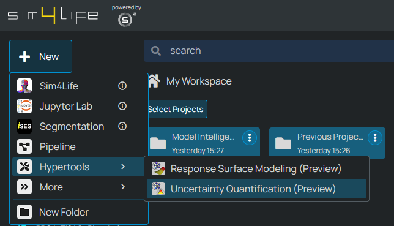

.. meta::
   :scope: S4L_only

.. _MetaModeling_HyperToolCreation:

Using Model Intelligence HyperTools
=====================================

Model Intelligence HyperTools provide specialized interfaces for advanced modeling capabilities in S4L. You can create different types of Model Intelligence HyperTools from the Dashboard to perform specific analysis tasks.

Currently Model Intelligence HyperTools are in Preview mode. Two HyperTools have been made available to all users at this stage:

- **Response Surface Modeling (RSM) HyperTool**: surrogate models enable interactive visualizations of the relationship between input parameters and simulation outcomes, enabling users to rapidly gain major insights into their models.

- **Uncertainty Quantification (UQ) HyperTool**: Enables statistical analysis of how uncertainties in input parameters propagate to simulation results, helping assess the robustness of your models.

To create a new HyperTool, navigate to the Dashboard, click the *+ New* button on the top left, and navigate to the *HyperTools* section. There, choose the HyperTool of interest.

.. figure:: MetaModeling_figures/CreateRSMHyperTool.png
   :align: center
   :width: 60%

   Creating a new Response Surface Modeling HyperTool from the Dashboard

   Creating a new Uncertainty Quantification HyperTool from the Dashboard
