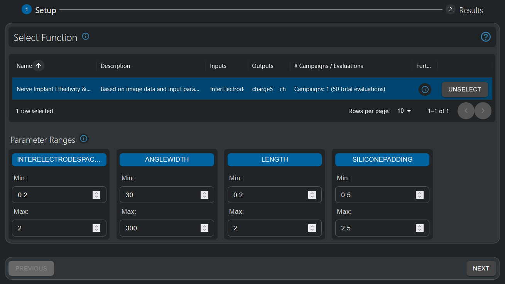

.. meta::
   :scope: S4L_only

.. _MetaModeling_Setup:

Setup Screen Overview
======================

The Model Intelligence HyperTools Setup screen is the initial configuration interface where users define the foundation for their meta-modeling analysis. This screen is divided into two main steps that guide users through the essential setup process.

Step 1: Select Function
-----------------------

The first step in the Setup screen focuses on function selection and configuration, providing users with comprehensive control over their analysis scope.

   Function selection interface showing available functions with their inputs, outputs, and evaluation data

Function Selection Table
~~~~~~~~~~~~~~~~~~~~~~~~~

The central component of Step 1 is an interactive table displaying available functions with the following columns:

**Name**
  Lists all available functions created from your simulation pipelines. Functions represent immutable snapshots of your computational workflows, ensuring consistency across analysis sessions.

**Description**
  The user-provided description is a brief overview of what each function computes, helping users identify the appropriate function for their analysis goals.

**Inputs**
  Displays the input parameters exposed by the function, such as design parameters, material properties, or simulation settings.

**Outputs**
  Shows the quantities of interest (QoIs) that the function can compute, including performance metrics, safety indicators, or other derived quantities.

**# Campaigns / Evaluations**
  Indicates the number of sampling campaigns and total evaluations available for each function, providing insight into the data richness already available for to generate a surrogate model. Further sampling campaigns can be always be generated in the next screen.

**Further Actions**
  Provides access to additional function details through the info button (ⓘ).

Function Selection Process
~~~~~~~~~~~~~~~~~~~~~~~~~~

1. **Browse Available Functions**: Review the table to identify functions relevant to your analysis objectives.

2. **Function Details**: Revise input & output data, as well as available evaluations, to ensure that you are choosing the right function.

3. **Select Function**: Click on the desired function row / Select button to select it. A selected function will show highlighted on the table. The "UNSELECT" button allows you to deselect if needed. Selecting another function will always have the effect of de-selecting the current one.

Step 2 - *Response Surface Modeling* : Parameter Ranges
------------------------------------------------------------------------

Once a function is selected, Step 2 becomes active, allowing users to define the parameter space for their analysis.

   Parameter range configuration interface showing minimum and maximum value settings for each input parameter

Parameter Range Configuration
~~~~~~~~~~~~~~~~~~~~~~~~~~~~~~~~~~~~~~~~~~~~~~~~~~~~~~~~~~~~~~~~~~~~~~~~~~~~~~~~~~~~~~~

For each input parameter exposed by the selected function, users can edit the parameter configuration through the **Parameter Cards**, in which it is shown:
  - Parameter name
  - Minimum value of the parameter range
  - Maximum value input field

Range Definition
~~~~~~~~~~~~~~~~~~~~~~~~~~~~~~
  - **Min**: Define the lower bound of the parameter range of interest
  - **Max**: Define the upper bound of the parameter range of interest
  - **Validation**: The system validates that minimum values are less than maximum values

Parameter Range Considerations
~~~~~~~~~~~~~~~~~~~~~~~~~~~~~~

**Design Space Coverage**
  - Ranges should encompass the full design space of interest.
  - If values at the boundaries are of interest, include additional margins beyond typical operating conditions, as surrogate models tend to be less accurate towards the edges of the parameter space due to the lower amountof surrounding observation data.
  - Ensure ranges are physically meaningful and achievable.

**Accuracy at Boundaries**
  - Surrogate models may be less accurate at the limits of the sampling space
  - Consider expanding ranges slightly if high accuracy is needed at the boundaries
  - The system may automatically suggest range adjustments for improved accuracy

**Computational Efficiency**
  - Larger ranges require more samples for adequate coverage
  - Balance comprehensive coverage with computational cost

Step 2 - *Uncertainty Quantification* : Parameter Distributions
------------------------------------------------------------------------

Once a function is selected for Uncertainty Quantification analysis, Step 2 becomes active, allowing users to define the statistical distributions for their input parameters to characterize uncertainty propagation through the model.

.. figure:: MetaModeling_figures/UQSelectFunctionParameterDistributions.png
   :align: center
   :width: 80%

   Parameter distribution configuration interface showing statistical distribution options for uncertainty quantification analysis

Parameter Distribution Configuration
~~~~~~~~~~~~~~~~~~~~~~~~~~~~~~~~~~~~~

Unlike Response Surface Modeling which uses fixed parameter ranges, Uncertainty Quantification requires defining statistical distributions that represent the natural variability or uncertainty in each input parameter. Each parameter is presented in a dedicated card with the following configuration options:

**Parameter Cards**
  Each parameter card displays:
  - Parameter name
  - Distribution form dropdown menu (constant, uniform, normal...)
  - Statistical parameters specific to the chosen distribution

**Distribution Form Selection**
  The dropdown menu allows selection from several statistical distribution types:
  
  - **Normal (Gaussian)**: Most common for naturally occurring uncertainties, characterized by mean and standard deviation
  - **Uniform**: For parameters with equal probability across a defined range, such as design parameters for which the value is decided by the operator
  - **Constant**: For parameters with no uncertainty (fixed values)

Distribution Parameters
~~~~~~~~~~~~~~~~~~~~~~~

**Normal (Gaussian) Distribution**
  The most commonly used distribution for biological and material property uncertainties:
  
  - **Mean**: The central value around which the parameter varies (e.g., literature values from databases like IT'IS Low Frequency Tissue Database)
  - **Standard Deviation**: Measure of variability around the mean, often expressed as a percentage of the mean value (commonly 10-20% for biological parameters)

**Uniform Distribution**
  For parameters with equal likelihood across a range:
  
  - **Minimum**: Lower bound of the uniform distribution
  - **Maximum**: Upper bound of the uniform distribution

Statistical Considerations
~~~~~~~~~~~~~~~~~~~~~~~~~~

**Biological Parameter Uncertainty**
  - Naturally occurring uncertainties, such as those of tissue properties, typically follow normal distributions with 10-30% standard deviation
  - Mean values should be based on established literature sources (e.g., IT'IS database)
  - Consider inter-subject variability in biological parameters
  - Account for measurement uncertainty in experimental data

**Parameter Correlation**
  - Uncertainty Quantification assumes that the input parameters are independent of each other
  - Nonetheless, inter-dependence on output predictions can be correctly captured by the surrogate model
  - If input parameters are closely tied together (e.g. connective tissue conductivity at different locations) it is recommended to include them as a single parameter

**Distribution Validation**
  - Ensure statistical parameters result in physically meaningful ranges
  - Verify that distribution tails (i.e. mean +- twice the standard deviation) don't extend into non-physical regions

Setup Validation and Best Practices
-----------------------------------

Pre-Setup Requirements
~~~~~~~~~~~~~~~~~~~~~~

Before accessing the HyperTool, ensure:

1. **Pipeline Development**: Your computational pipeline is fully developed and tested
2. **Function Creation**: Functions have been created and exposed from your pipelines
3. **Parameter Validation**: Input parameters and outputs are properly defined and meaningful

Error Prevention
~~~~~~~~~~~~~~~~

Common setup issues and their prevention:

**Incomplete Function Data**
  - Verify sufficient evaluation samples exist for selected functions. Otherwise, please run additional sampling campaigns.
  - Check that all required input parameters are properly exposed before running any samples. To ensure consistency, samples are not transferrable between functions - therefore, additional input parameters will need to be added to a new function and sampling campaigns need to be re-run.
  - Ensure output quantities are correctly defined and computed. For the same reason as the previous point (functions must be inmutable to ensure consistency of results), a modification of the pipeline to change which or how output quantities are computed will need to result in a new function, and new sampling campaigns will need to be run.

**Invalid Parameter Ranges**
  - Confirm minimum values are less than maximum values
  - Verify ranges are within physically meaningful bounds
  - Check unit consistency with parameter data processing within your pipeline
