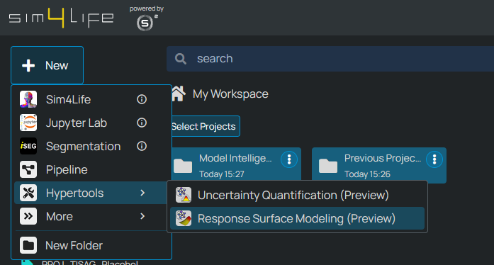
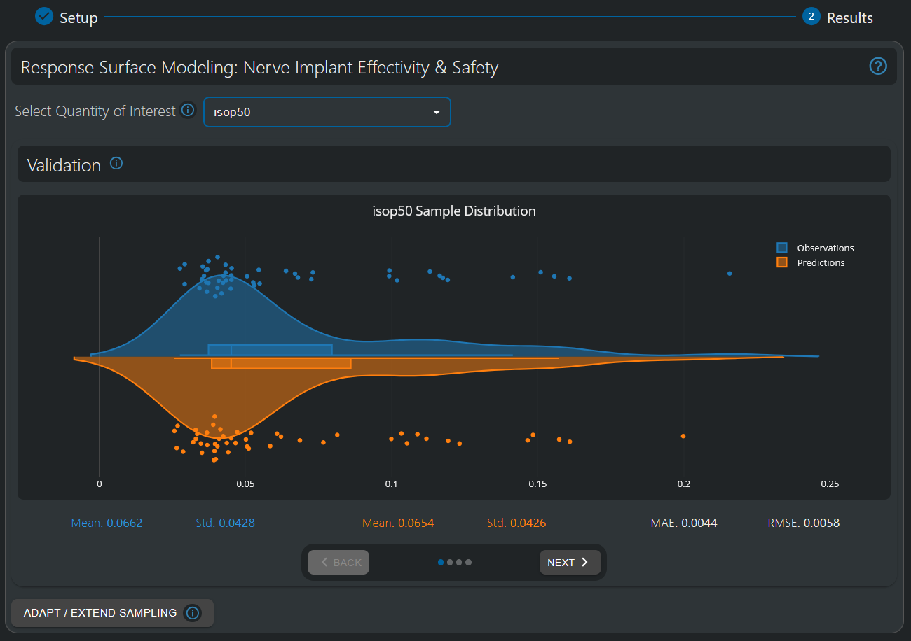
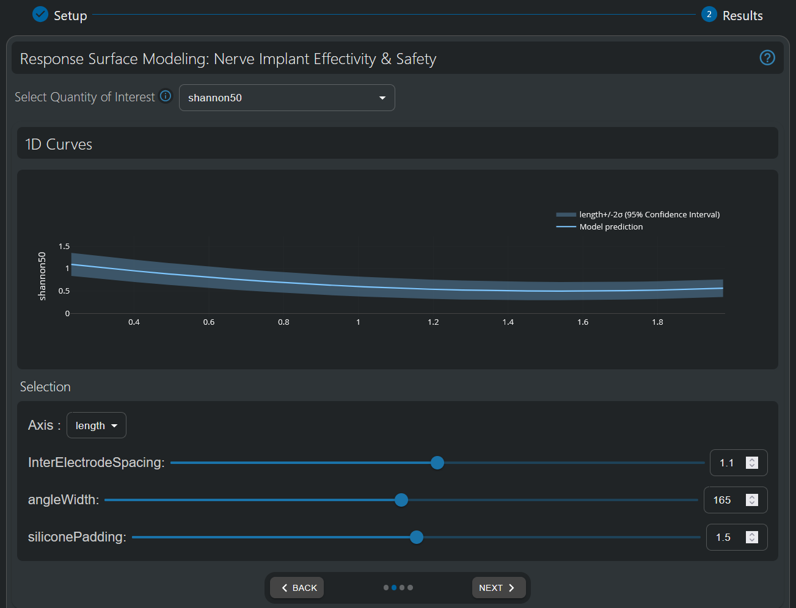
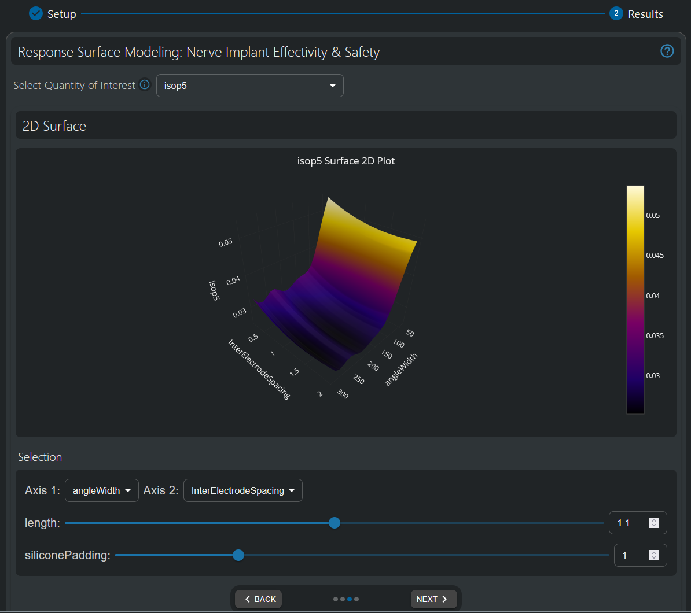
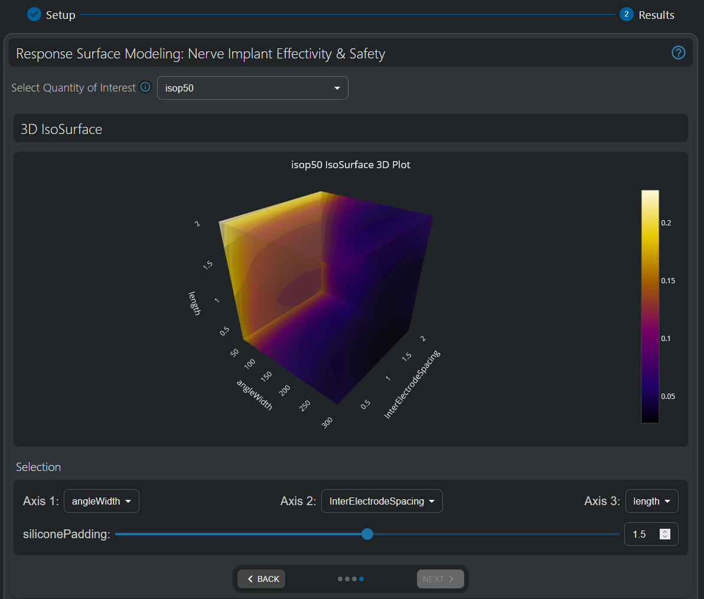
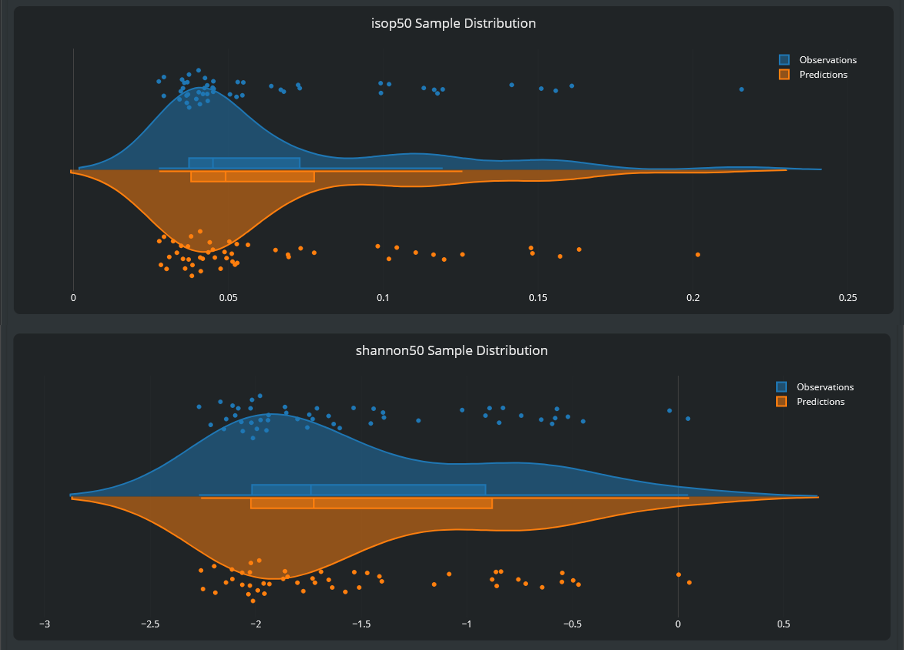
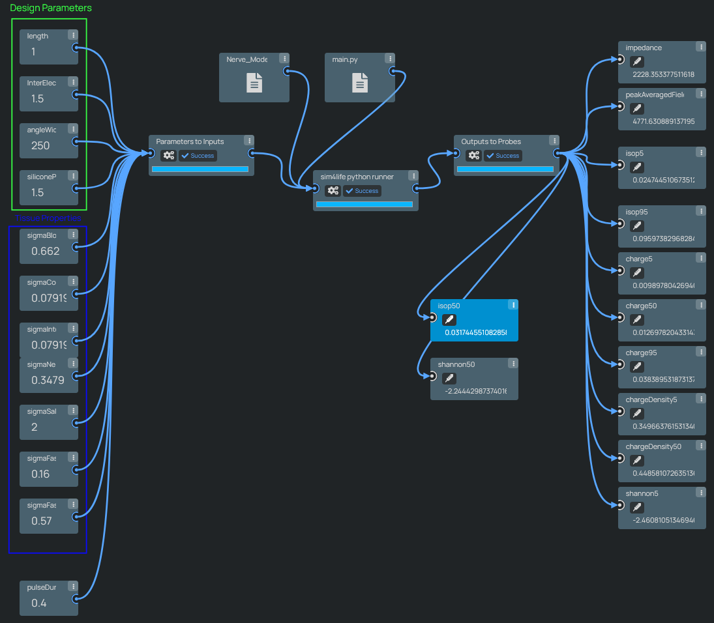

.. meta::
   :scope: S4L_only

.. _ResponseSurfaceModelingTutorial_NerveDemo:

.. include:: /icons.txt

Model Intelligence Tutorial - Sural Nerve Pain Relief Neural Implant Design Optimization
====================================================================================================

.. admonition:: Model Intelligence: A Paradigm Shift in Simulation Analysis

  Meta-modeling (or surrogate modeling) represents a transformative approach to understanding complex simulation models. By creating simplified mathematical representations of computationally intensive simulations, meta-modeling enables rapid exploration of parameter spaces that would otherwise require thousands of time-consuming simulations. This "model intelligence" approach empowers users to gain deeper insights into parameter sensitivities, optimize designs efficiently, quantify uncertainties, and make data-driven decisions with unprecedented speed. For bioelectronic applications, where biological variability and design parameters interact in complex ways, meta-modeling transforms raw simulation data into actionable knowledge—revealing relationships between inputs and outcomes that might remain hidden in traditional simulation approaches. The techniques you'll learn in this tutorial represent a major advancement in simulation analysis, allowing you to extract maximum value from your models while dramatically reducing computational overhead.

------------
Introduction
------------

This tutorial demonstrates the potential of Model Intelligence Hypertools to provide actionable insights for bioelectronic device design, balancing effectivity and safety.

In particular, a neural implant at the sural nerve will aim to disrupt pain signals for sural nerve pain patients, a chronic pain condition, while keeping within safe stimulation limits to prevent damage to the nerve and neighbouring tissues.

-------------
Preparation
-------------

    #. Sign into your sim4life.io / sim4life.science account. 
    #. Click on the *+ New* button on the top left of the *Dashboard*.
    #. Under the Hypertools section, choose *Response Surface Modeling*

   HyperTools are available in the *+ New* menu.

-------------------------------------------------------------
Pipeline
-------------------------------------------------------------
.. tip:: For this tutorial, this pipeline has already been set up & a full sampling campaign executed, so that users can directly explore the Response Surface Modeling HyperTool's features. Details on the pipeline setup are provided here for completeness.

- **Pipeline Workbench**

  The workspace includes:
    #. **Input parameters** for electrode design parameters, tissue conductivities, and simulation parameters.
    #. **Computational nodes** which will build the model, perform simulations and extract numerical resultss based on the values of the input parameters.
    #. **Output probes** for resulting output metrics (quantities-of-interest, QoIs).
      
      .. figure:: MetaModeling_figures/NervePipeline.png
        :align: center
        :width: 65%
      
      Nerve Implant Effectivity & Safety pipeline, including nodes for input parameters and output QoIs.

- **Modeling & Simulation Workflow**

  The computational pipeline includes the following steps:

    #. Loading a segmented histological nerve cross-section (multifascicular).
    #. Generating a 2D mesh and performing a 2.5D extrusion.
    #. Inserting two electrodes with parameterized angle width, length, inter-electrode spacing, and extra silicone insulation padding at both ends.
    #. Setting up an electromagnetic (EM) simulation with parameterized conductivity for blood, epineurium, perineurium, surrounding tissue, and fascicles (longitudinal and transversal).
    #. Extracting impedance and E_IEEE (ICNIRP) peak exposure.
    #. Extracting charge-per-phase, charge-density-per-phase, and Shannon criteria, as safety-related metrics for neurostimulation.
    #. Adding fiber trajectories with statistically varying diameters.
    #. Performing estimation of neurophysiological activation thresholds and extracting recruitment isopercentiles (10/50/90%) in terms of current (mA).

.. - **1.3 Configuring Inputs and Parameters**
.. The steps used to build the pipeline were the following:

..   #. **Insert Input Parameters:**  
..     - L: Electrode length  
..     - W: Electrode width  
..     - S: Inter-electrode spacing  
..     - σ_tissues: Conductivities for epineurium, perineurium, surrounding tissue, fascicles (axial/radial)  
..     - pulse_duration: Stimulation pulse duration

..   #. **Connect Parameters:**  
..     - Link each parameter to the corresponding port in the pipeline.
..     - Assign clear, descriptive names to each parameter for easy identification.

..   #. **Add Data and Scripts:**  
..     - Insert a Python runner service to build the model based on a histological image, simulate EM and neurophysiological results, and compute derived quantities such as:
..       - Impedance
..       - E_IEEE (ICNIRP) peak
..       - Power consumption
..       - Charge injection
..       - Recruitment isopercentiles

..   #. **Insert Probes:**  
..     - Add probes to monitor and extract the quantities computed
..     - Give each probe a meaningful name.

.. .. note:: at this point, when building your own pipelines, we highly encourage you to test your pipeline with different input parameters and ensure the validity and consistency of the results. MetaModeling workflows will use your pipeline as their ground truth, and can only be as valid and accurate as your pipeline is.

.. - **1.4 Creating and Exposing Functions**
..   #. Return to the Dashboard.
..   #. Click in your copy of the "MMUX Nerve Model" to open the study card.
..   #. Click the **Create Function** section on the left vertical menu.
..   #. In the dialog:
..     - Provide a meaningful name for your function.
..     - Choose which parameters will be exposed as function inputs. For the first part of the tutorial, please select the design parameters of the electrode (e.g., L, W, S) and deselect all others.
..     - Set fixed values for the inactive parameters - we advise you to leave the already defined values, which were taken from the IT'IS Low Frequency tissue properties database.
..     - Select which probes will be exposed as outputs.
..     - Optionally, write a description of your function, as this could help you remember the functionality in your pipeline, version or modifications you performed to the code...
..     - Press the "Create Function" button, and check that the platform confirms that the operation was performed successfully.

.. .. note:: this operation has created a function, which is an immutable entity to ensure consistency of the results. Therefore, your function is based on a read-only copy of your study - any modifications performed to your study in the future WILL NOT affect your function. If you wish to modify, correct or change your pipeline in any way, you will then need to create a new function from it which will be completely independent from the previously created one.

-------------------------------------------------------------
HyperTool Setup
-------------------------------------------------------------

- **Starting a Response Surface Modeling HyperTool**

  - In the Dashboard, press the "+ New" button on the top left
  - In the **Hypertools** section, click on the "Response Surface Modeling" option.
  - Wait for the service to load.

- **Choosing a Function**

  - In the "Function Setup" step, select the "Nerve Implant Effectivity & Safety" function. 
    - It should have the defined design parameters (Inter-Electrode Spacing, Angle Width, Length, Width, and Silicone Padding) as inputs, and the defined QoIs as outputs. 
    - The info button allows visualization of the underlying pipeline.
  - For this tutorial, parameter ranges have already been determined.

  .. figure:: MetaModeling_figures/ChooseFunctionAndRanges.png
    :align: center
    :width: 65%

    The HyperTool allows choice of the function to be analyzed, and definition of the parameter ranges of interest. For this tutorial, these ranges have already been set.

  - Once all parameter ranges have been choosen (pre-selected in this tutorial), click "Next" to move to results analysis.
  - Wait until the AI model is generated. This operation might take a few minutes.

.. - **Sampling and Sample Selection**

.. This step allows you to select which samples (evaluations) of your function you wish to use in subsequent steps. If, as now, you do not yet have any samples, or those samples are considered insuficient to build an accurate model, in this screen you also have the chance to create and run a new sampling campaign.

.. A sampling campaign is a set of evaluation which belong together for the following reasons:
..   - They are evaluations of the same function.
..   - They are contained in user-specified parameter ranges.
..   - They aim to cover the user-specified parameter ranges in a consistent manner (Latin Hypercube Sampling, Uniform Grid Sampling...) in order to provide a good sample set to build a surrogate model in that domain.

.. In this tutorial, we will be using the Latin Hypercube Sampling (LHS) strategy, as it provides much better coverage of the parameter space than random sampling, and needs significantly less samples than a Grid Sampling strategy.

.. To set up an LHS sampling campaign:
..   - Click the "+ Run new sampling campaign" button.
..   - Choose the LHS Sampling tab.
..   - Define the ranges of interest of your function's input parameters
..     - **TODO define those**
..   | Surrogate models are less accurate at the limits of the sampling space (as there are less points around) - therefore, if you need the results to be accurate at those limits, you can select the checkbox "Increase accuracy at parameter limits" to broaden the sampling range of the campaign for that variable. Alternatively, you might manually increase the range's limits.
..   - Define the number of samples to be evaluated.
..   - Optionally, define the seed used to create the sampling points. LHS contains random noise to improve parameter space coverage; to ensure reproducibility, identical parameters and seed must be used.
..   - Click **Run** to launch the samples. They will be run using our scalable, cloud-based infrastructure.
..   - The Task Manager can now be accessed. Samples will appear in the "Pending" column once generated, move to "Running" when they are being computed, and show as either "Completed" or "Failed" once completed.

.. .. note:: if a task fails, or completes with unconsistent results, it might indicate an issue in your pipeline. We encourage you to click on the corresponding's job card to open the study clone in a new tab and inspect the files generated during execution of the pipeline.

.. At this point, your samples are running in our cloud-based infrastructure. You might close the MMUX study and go back to the Dashboard to work on a different project or leave the platform - your samples will keep executing.

.. - **Validate Model Quality**

.. Once all samples have been evaluated, we are ready to continue this tutorial. If you went out of the MMUX study, please open it again and click "Next" to move to the Sample Selection step.

.. Now you will be able to see the executed sampling campaign on the table. 

..   - Select the sampling campaign using the tickbox. This selects all samples belonging to that campaign.

.. .. note:: while choosing a full samplign campaign is typically the best option, as it ensures consistent sampling of the parameter ranges of interest, you might want to use the toggle to check the input-output values of the samples that are contained and deselect specific samples - for example, if you found out that your pipeline gives incorrect results at certain parameter ranges, but you still wish to use all the other samples instead of running a completely new sampling campaign.

.. .. note:: it is possible to combine the results from multiple campaigns to, for example, increase the number of available samples, or expand the covered parameter range. However, please exercise caution, as this might introduce "empty volumes" in the parameter space in which none of the multiple campaigns have any samples but are still within the joint parameter space of the combined sample set. Surrogate models could become largely inaccurate in those spaces and thus a poor combination of sampling campaign might produce worse surrogate-modeling approximations of the base pipeline than each of the individual sampling campaigns.

..   - Once you have selected your sample campaign to be used to build the surrogate model, click "Next" to move to the surrogate model building step.
..   - Select the Quantity of Interest (QoI) that you wish to build a Surrogate Model of.
..   - Click on the "Build Surrogate" button.

.. Some metrics and graphs will be displayed to enable you to assess the quality of the surrogate model that was built. Whether less or more samples are necessary to build an accurate surrogate model depends on the underlying model - how rapidly the QoI varies which respect to the input parameters, how large is the output range, whether an input parameter(s) has a dominant effect and overshadows the influence of the other parameters... The MMUX Surrogate Building functionality aims to provide clear indicators and statistics of both the responses and the deviations due to the surrogate approximation - however, the final decision regarding which level of accuracy and fidelity is necessary corresponds to the final user.

.. Once the surrogate model for a given QoI has been built, it is possible to produce plots that allow analysis of the influence of single parameters, or the joint influence of two or three parameters over their full range.

.. **TODO include screenshots & interpretations of the diff plots (1D, 2D, 3D).**

-------------------------------------------------------------
Analysis of Results
-------------------------------------------------------------

The Response Surface Modeling HyperTool allows users to visualize the influence of parameters on their output of choice both in 1D, 2D and 3D. If there are additional input parameters, they need to be fixed to constant values in order to obtain a projection that can be visualized. These values can be interactively changed with sliders, thus allowing to explore the full high-dimensional space.

- **Validate Model Quality**

Model Intelligence HyperTools fit a surrogate model to simulated data (samples), also known as "observations". Based on these, which are considered the ground-truth, but take considerable computational resources to compute, a surrogate model (also called meta-model) is created that maps the input-output relationships of the full simulation pipeline. This low-complexity model can be used to gain insights on high-dimensional parameter dependencies at low computational cost, and for further applications such as surrogate-based optimization, model-based control, uncertainty quantification...

Nonetheless, before using a surrogate model, the user is encouraged to inspect its quality-of-fit, and validate whether it is a suitable approximation of the simulation pipeline. In order to do so, a technique known as Cross-Validation is used, by which a surrogate model is fitted with a portion of the data. Then, the data that was hidden during training (validation set) is used to perform predictions and compare to the real simulated values. This procedure is performed multiple times, until all samples have been used once in the validation set. Comparing the predictions on all samples to their real simulated values provides a lower-bound confidence on the accuracy of the final surrogate model, which will be trained with all samples.

In the first visualization of the Response Modeling HyperTool, a violin plot is displayed, which compares the sample values and distributions of the full-simulation observations versus their cross-validation predictions. Similar distributions, as well as low mean error at the per-sample level, indicates a good quality-of-fit.

Furthermore, the mean and standard deviation of both the observations and the predictions' distribution is displayed, together with the per-sample Mean Absolute Error (MAE) and Root Mean Square Error (RMSE). Comparing these error metrics with the data distribution values can provide an idea of the magnitude of the prediction errors compared to the variance present in the data.

  The violin plot provides a tool to validate whether the distribution of cross-validation predictions matches that of the ground-truth observations. Moreover, we can compare the scale of the MAE (~4e-3) with the scale of variance in the data (standard deviation ~ 4e-2), showing that prediction error is only ~10% the variability in the data distribution, further strengthening the visual impression of the violin plot that the surrogate model is appropriately fitting the underlying observations.

Once the surrogate model has been deemed appropriately well fitted, it is time to use it to gain insights into the outputs' (QoI) dependencies on the input parameters. For that purpose, visualizations based on one, two, or three simultaneous parameters can be seamlessly and efficiently generated through the Response Surface Modeling HyperTool. Please click the "Next" button to move to the 1D Curves visualization tool.
Please note that the data (and the surrogate model fitted to it) is N-dimensional (with N=4 in this tutorial) - which is not possible to visualize. Nonetheless, it is possible to examine lower-dimensional "slices" or "cross-sections" of the model (i.e. by fixing the value of some of the parameters in order to obtain lower-dimensional predictions). These slices, while not able to capture the dependencies on the fixed value parameters, can provide very valuable information on the parameter dependencies displayed. Moreover, by interactively changing the values assigned to the fixed parameters, it is possible to also gain an understanding on their role, both towards the output and their possibly complex interplay with other parameters. Therefore, lower-dimensional visualizations can still allow to gain deep understanding of parameter dependencies of the broader, high-dimensional model. 

- **1D Curve Response**

In the 1D Curves visualization tool, the X axis represents the range of values of the selected input parameter (selectable at the "Axis" dropdown below the graph), while the Y axis represents the values of the QoI of choice (selectable at the top select box).

.. note:: Gaussian Processes (GP), also known as Kriging, are used as surrogate models. These provide the advantage of not only providing a prediction of the data value, but also the associated uncertainty, which is very useful to assess confidence in the results. In the 1D Curve Responses, this confidence is displayed as the shaded area, indicating the 95% confidence interval (i.e. mean + - twice the standard deviation, for a Gaussian error distribution).

Moreover, the values of the other parameters can be dynamically adapted, either using the slider, setting a value in the textbox, or using the up/down arrows in the textbox. We encourage you to play with the interactive visualization to gain understanding on the parameter dependence of the QoIs at different "areas" of the model.

  One-dimensional visualization of the dependence of the Shannon Criteria of safety in neurostimulation with respect to electrode length. A clear dependence is observed - lower length lowers the Shannon Criteria value up to ~1.5mm, from a value over 1.0 to below 0.5, therefore making the device substantially safer. 
  While the uncertainty bands appear relatively wide, they represent a high degree of confidence (95%) on a full-simulation sample lying within the shadowed range, following a normal (Gaussian) distribution around the predicted value. As the parameter dependency effect is still larger than it, thus providing assurance that the effect is soundly supported by the data underlying the model.

- **2D Surface Response**

Two-dimensional response surfaces allows to inspect the parameter dependence of the output with respect to two input parameters simultaneously. 

As in the 1D Curves visualization tool, below the graph it is possible to modify the input parameters to visualize with the *Axis 1* and *Axis 2* dropdowns, and the fixed value of the other parameters can be interactively adapted at the sliders or their textbox.

  Two-dimensional visualization of the 50% isopercentile threshold (i.e. current [mA] necessary to activate 50% of the fibers in the nerve). A lower isopercentile threshold indicates easier stimulability (i.e. less current is needed to achieve the same level of stimulation) and is therefore preferred.
  Low angle widths (e.g. low coverage of the nerve) naturally result in difficulties to estimulate enough fibers, while it seems to flatten from ~120º - further coverage does not necessarily facilite stimulation, once the electrode is in close proximity to enough fibers. Minima are observed at ~200º and ~250º, which could indicate proximity to a more superficial fascicle. However, the low relative magnitude of these changes advises caution, as these variations might very well be within the uncertainty associated to the surrogate model and therefore not necessarily reflect a real low-amplitude variation in the modeled simulation pipeline.
  On the other hand, Inter-Electrode Spacing shows a clearer but smaller influence on the output, with bigger spacing leading to lower stimulation thresholds.
  

- **3D Iso-Surface Response**

Three-dimensional data can be visualized through iso-surfaces (i.e. the surface of all points with the same value), which are then color-coded. Similar to previous visualization, the parameters of interest can be selected at the dropdowns below the graph, and the fixed-value parameters can be modified at the slider.
This visualization provides the most information on the complex interplay between different parameters.

  Three-dimensional visualization of the 50% isopercentile threshold (i.e. current [mA] necessary to activate 50% of the fibers in the nerve). 
  As observed in the two-dimensional visualization, both higher angle widths and inter-electrode spacings contribute towards lower stimulation thresholds. Moreover, lower electrode lengths also seem to contribute in that regard - although, as seen in the one-dimensional, this would have a detrimental effect on the safety-related Shannon Criteria.

- **Extracting Quantitative Insights**

The tools shown above allow to gain both qualitative and quantitative insights on output parameter dependence. 

In this tutorial, these visualization tools will be used to define design parameters of the sural nerve implant stimulator which appropriately balance effectivity (isopercentile threshold current at 50% fiber recruitment, *isop50*) and safety (Shannon Criteria at the same current level, *shannon50*).

.. figure:: MetaModeling_figures/Isop50Shannon50Comparison.png
  :align: center
  :width: 65%

  Three-dimensional visualizations of the two main quantities of interest - 50% isopercentile threshold (i.e. current [mA] necessary to activate 50% of the fibers in the nerve) and Shannon Criteria at that curren level - which should both be minimized for enhanced effectivity and safety.
  While both metrics seem to benefit from large angle widths and inter-electrode spacing, smaller length benefits effectivity but harms safety, advising an intermediate value as a compromise.

.. figure:: MetaModeling_figures/1DCurves_Isop50_Shannon50_angleWidth_Length.png
  :align: center
  :width: 65%

  The insights gained on the three-dimensional visualizations can be further explored through one-dimensional cross-sections, which also provides estimates of uncertainty.
  The figure shows dependence on the angle width and length parameters (which play the largest roles) on both 50% isopercentile current and Shannon Criteria. As seen in the three-dimensional visualizations, while both efficiency and safety benefit from wider angle width, we must find a compromise value in terms of length.

Based on all the visualization explored through this tutorial, the following design parameters were chosen as optimal:
- Angle Width : 250º
- Inter-Electrode Spacing: 1.5mm
- Length: 1mm
- Silicone Padding: 1.5mm

  Distribution of the two main outputs of interest (50% isopercentile current and Shannon Criteria at that current level). 
  Based on the insights obtained, the optimal configuration should produce an isopercentile slightly above 0.03mA, and a Shannon Criteria value around -2.2 (the threshold is typically considered to be +1.85, so this can be considered a very safe value).

- **Validation of Design Parameters through Full Simulation Pipeline**

In order to validate the chosen design parameters based on the insights provided by the Response Surface Modeling HyperTool, the tool enables to run a parameter configuration of choice to verify that the full simulation results align with predictions.
To this end, the design parameters considered optimal above will be run, using the tool under *Adapt / Extend Sampling* - *Create new sampling campaign* - *Test run*. 

.. .. tip:: Model Intelligence HyperTools are currently in Preview mode. We will be happy to provide you with full-featured access, which includes running test samples and full sampling campaigns, upon request to our support channels. Happy meta-modeling!

  Pipeline run through the *Test Run* functionality - which will show in a new tab and in the user's Dashboard. 
  As predicted, this configuration shows both a 50% isopercentile current under 0.05mA and a Shannon Criteria below -2.0, which means it is on the lower (i.e. better) range of the effectivity and safety QoIs simultaneously.

-------------------------------------------------------------
Conclusion
-------------------------------------------------------------

In this tutorial, we've explored how Response Surface Modeling can transform complex bioelectronic simulations into actionable design insights. Through the Model Intelligence approach, we were able to:

#. **Analyze complex parameter dependencies** across a multidimensional design space without running thousands of simulations
#. **Visualize critical relationships** between design parameters (electrode dimensions, spacing, angle) and performance metrics
#. **Balance competing objectives** of efficacy (lower isopercentile thresholds) and safety (Shannon criteria)
#. **Make data-driven design decisions** that would be difficult or impossible with traditional parameter sweeps

The analysis revealed several key insights:
- Wider angle coverage (around 250°) significantly improves nerve fiber recruitment
- Larger inter-electrode spacing (1.5mm) reduces stimulation thresholds
- Electrode length presents a tradeoff between efficacy and safety, with 1mm providing optimal balance
- Silicone padding (1.5mm) contributes to the overall optimal design

Most importantly, the surrogate model predictions were validated through full simulation, confirming that our optimized design achieves the desired 50% isopercentile current under 0.05mA while maintaining a Shannon Criteria below -2.0 - well within safety limits.

This tutorial demonstrates how Model Intelligence tools dramatically accelerate the bioelectronic device design process, reducing computational overhead while providing deeper insights into complex parameter relationships. These techniques represent a paradigm shift in simulation analysis, transforming raw data into actionable knowledge that can directly inform better, safer bioelectronic interventions.

.. tip:: Model Intelligence HyperTools are currently in Preview mode. We will be happy to provide you with full-featured access upon request to our support channels. Happy meta-modeling!

-------------------------------------------------------------
Next Steps
-------------------------------------------------------------

For further exploration, we recommend proceeding to our next tutorial that demonstrates how to establish statistically rigorous confidence intervals for the optimal design parameters when accounting for the inherent variability in human tissue properties. 

The Uncertainty Quantification HyperTool provides a robust framework for quantifying output variability - a critical requirement for regulatory submission and clinical translation of bioelectronic devices. This capability allows engineers and researchers to efficiently demonstrate the statistical reliability of their designs across physiologically relevant parameter ranges.

.. -------------------------------------------------------------
.. Part 3: Uncertainty Quantification
.. -------------------------------------------------------------

.. - **3.1 Creating Additional Functions**

..   - Return to your project and create another function, this time exposing different parameters (e.g., tissue conductivities) as inputs, while fixing others (e.g., L, W, S).

.. - **3.2 Instantiating SuMo-based Uncertainty Propagation**

..   - Back in the dashboard, instantiate a **SuMo-based uncertainty propagation** tool.
..   - Repeat the surrogate modeling steps with the new function.

.. - **3.3 Step 3: Propagate Uncertainty**

..   - Specify uncertainty types (e.g., Gaussian) and parameters (mean, standard deviation) for each input.
..   - Click **Propagate** to compute and inspect the resulting output probability distributions.
..   - Add these results to your report as needed.

.. -------------------------------------------------------------
.. Conclusion
.. -------------------------------------------------------------

.. You have now completed the MMUX MetaModeling Pipeline tutorial. You should be able to set up, run, and analyze MetaModeling studies using MMUX, including advanced surrogate modeling and uncertainty quantification. For more information, refer to the [MMUX documentation](https://mmux.example.com/docs) or contact support.

.. Happy meta-modeling!