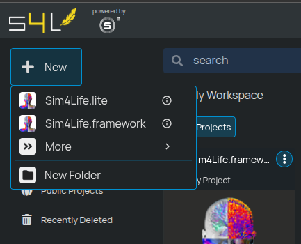
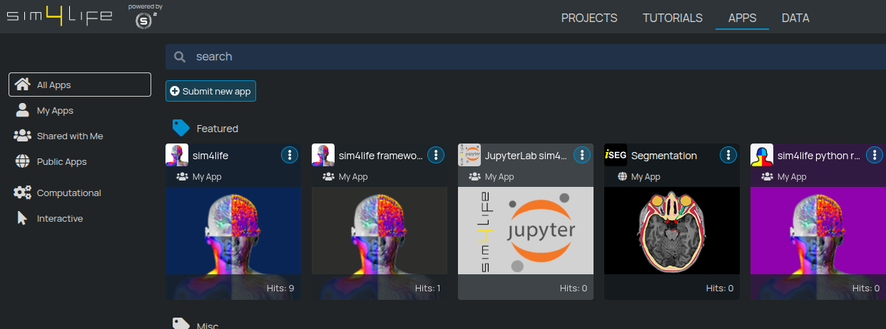
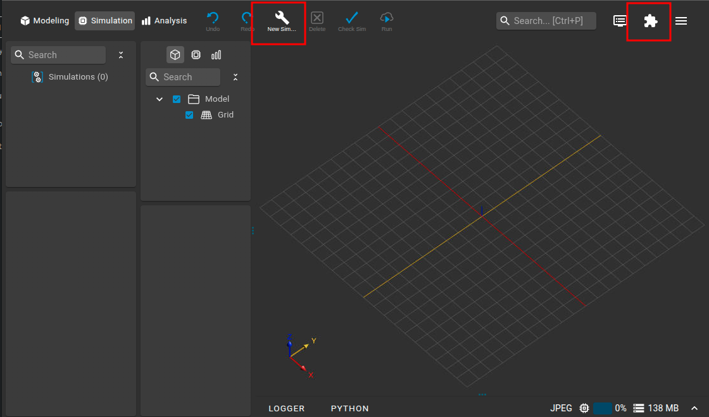
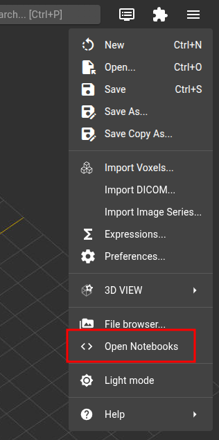
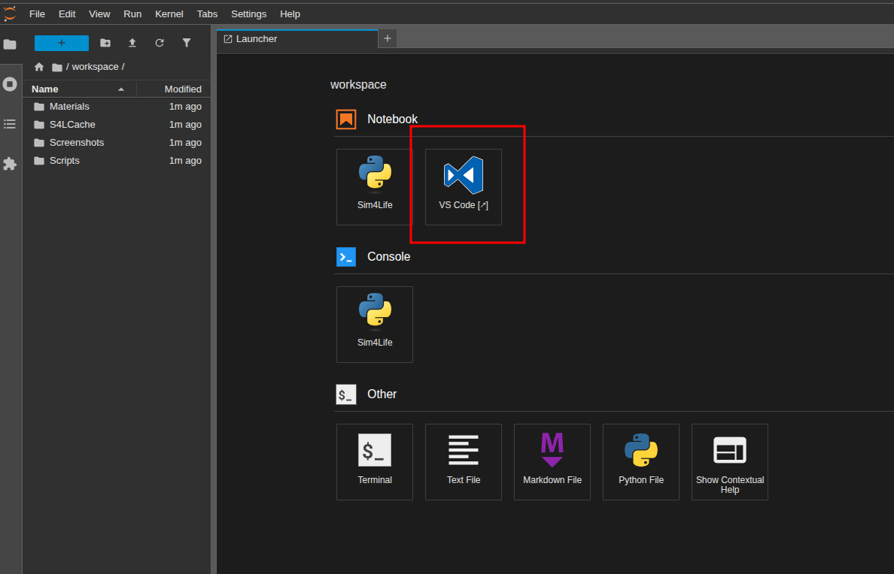
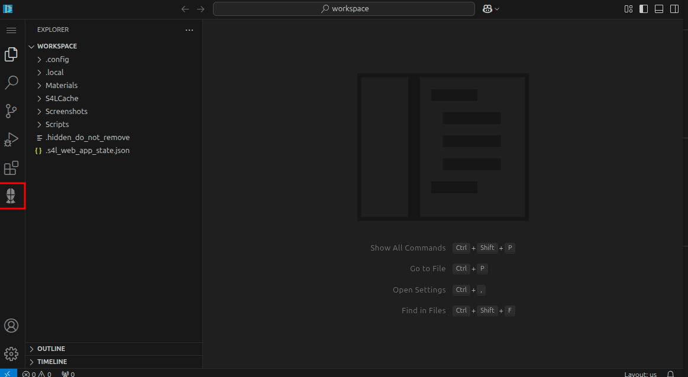
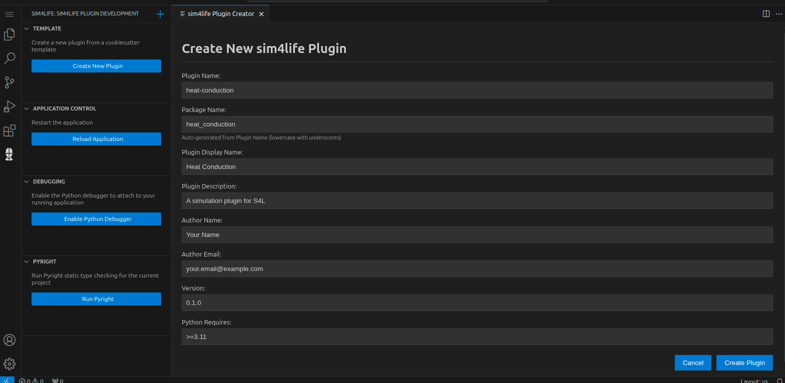
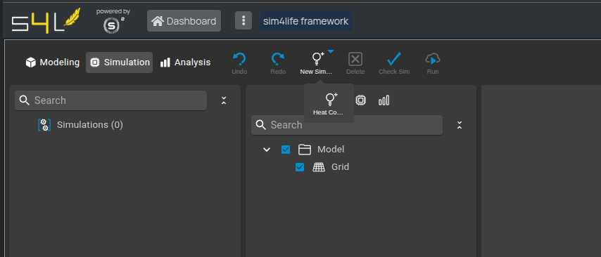
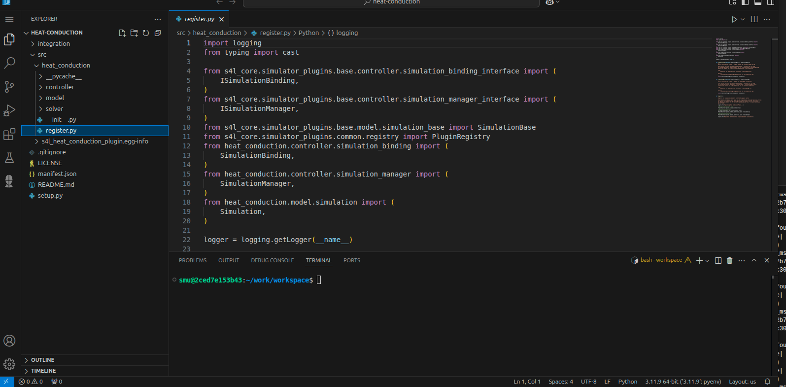

## Getting Started

To begin, you need to start the Sim4Life Framework application.

- **On s4l-lite.io:**  
  Click the **New** button to go to the service page.  
  { width=300 }
- **On sim4life.io and sim4life.science:**  
  Go to the **APPS** tab and click on the **Sim4Life Framework** tile.  
  { width=900 }

In both cases, you can then click on **Create Project** to start a new plugin project:

{ width=600 }

Once the application has started, you will see the familiar Sim4Life user interface. In the toolbar, look for the puzzle piece icon—this opens the Plugin Manager, where you can install existing simulator plugins. In the Simulator tab, you’ll notice a placeholder icon labeled “New Simulation”:

{ width=900 }

When you create your own plugin, your simulation will appear here.

---

# Quick Start Guide

This guide will help you get started with creating your first Sim4Life plugin using our framework.

## Creating a New Plugin

The quickest way to create a new plugin is to use our cookiecutter template embedded in a VS Code extension.

Let's start the integrated development environment (IDE) and create your first plugin using a template. Follow these steps:

1. Open the burger menu and select **Open Notebooks**. This will launch JupyterLab in a new browser tab:
   { width=300 }
2. In the JupyterLab launcher, click the **VS Code** icon. This will open Visual Studio Code in a new browser tab:
   { width=900 }
3. The Visual Studio Code environment comes pre-installed with Python extensions and a dedicated Sim4Life extension:
   { width=900 }
4. Click on the Sim4Life extension to access a set of tools specifically designed to support plugin development:
   { width=900 }

The Sim4Life extension provides several useful features for plugin development:

- **Create New Plugin:** Launches a form based on a cookiecutter template to help you create a new plugin.
- **Reload Application:** Restarts the application so that any changes you made to your plugin become available.
- **Enable Python Debugger:** Opens ports on the Sim4Life core application, allowing you to connect a debugger for advanced troubleshooting.
- **Run Pyright:** Runs the static type checker on your plugin to help catch errors early.

Let's take a closer look at the **Create New Plugin** feature. When you select this option, a form will appear:

{ width=900 }

Fill in the required information according to your needs and follow the prompts after clicking **Create Plugin**.

If everything goes smoothly, you should see a new entry in the Simulation tab under "New Simulation":

{ width=900 }

Additionally, VS Code will automatically open in the folder where your plugin's source code resides:

{ width=900 }

The plugin is installed in edit mode, and since it is located in the `work/workspace` folder, it will persist across restarts of the same project. However, it is good practice to sync your new plugin with a GitHub repository to ensure your work is safely backed up and version controlled.

## Next Steps

Once you've created your basic plugin, you can:

- [Learn more about creating simulations](../creating-a-plugin/creating-simulation.md)
- [Define additional settings](../creating-a-plugin/defining-settings.md)
- [Add drag-and-drop support](../creating-a-plugin/drag-and-drop.md)
- [Implement a custom solver](../solver-implementation/writing-solver.md)
- [Create data extractors](../extractors/creating-extractor.md)
