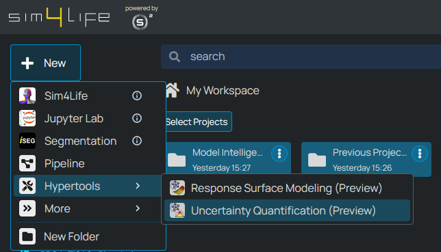

<!-- TODO We need a tutorial to creating Functions!!! -->

# Using Model Intelligence HyperTools

Model Intelligence HyperTools provide specialized interfaces for advanced modeling capabilities in Sim4Life. You can create different types of Model Intelligence HyperTools from the Dashboard to perform specific analysis tasks.

Currently Model Intelligence HyperTools are in Preview mode. Two HyperTools have been made available to all users at this stage:

- **Response Surface Modeling (RSM) HyperTool**: surrogate models enable interactive visualizations of the relationship between input parameters and simulation outcomes, enabling users to rapidly gain major insights into their models.

- **Uncertainty Quantification (UQ) HyperTool**: Enables statistical analysis of how uncertainties in input parameters propagate to simulation results, helping assess the robustness of your models.

## Creating a New HyperTool

To create a new HyperTool, navigate to the Dashboard, click the *+ New* button on the top left, and navigate to the *HyperTools* section. There, choose the HyperTool of interest.

*Creating a new Response Surface Modeling HyperTool from the Dashboard*

*Creating a new Uncertainty Quantification HyperTool from the Dashboard*

## HyperTool Types

### Response Surface Modeling (RSM) HyperTool

The RSM HyperTool creates surrogate models that approximate your simulation's behavior using mathematical functions. These lightweight models enable:

- **Interactive Parameter Exploration**: Modify parameters and see results instantly
- **Sensitivity Analysis**: Understand which parameters most influence your outputs
- **Design Space Visualization**: Explore multi-dimensional parameter relationships
- **Performance Optimization**: Find optimal parameter configurations efficiently

**Use Cases:**
- Parameter sweep analysis with complex, computationally expensive models
- Design optimization where many parameter combinations need evaluation
- Understanding parameter interactions and their effects on outcomes
- Real-time exploration of design spaces during decision-making

### Uncertainty Quantification (UQ) HyperTool

The UQ HyperTool quantifies how uncertainties in input parameters affect simulation outputs. It provides:

- **Uncertainty Propagation**: See how input variability affects output distributions
- **Confidence Intervals**: Understand the range of possible outcomes
- **Risk Assessment**: Evaluate robustness and reliability of designs
- **Statistical Analysis**: Comprehensive statistics on output uncertainties

**Use Cases:**
- Bioelectronic device design where biological parameter variability is significant
- Safety assessments requiring confidence bounds on critical metrics
- Robust design optimization accounting for manufacturing tolerances
- Regulatory submissions requiring uncertainty analysis

## Getting Started

Once you create a HyperTool, you'll be guided through the setup process:

1. **Function Selection**: Choose from available simulation functions
2. **Parameter Configuration**: Define ranges (RSM) or distributions (UQ)
3. **Analysis Setup**: Configure sampling and modeling parameters
4. **Results Exploration**: Use interactive interfaces to gain insights

## Next Steps

- Learn about the [Setup process](setup.md) for configuring your analysis
- Explore [Navigation features](navigation.md) for interactive analysis
- Review specific documentation for [Response Surface Modeling](response-surface-modeling.md)
- Understand [Uncertainty Quantification](uncertainty-quantification.md) capabilities