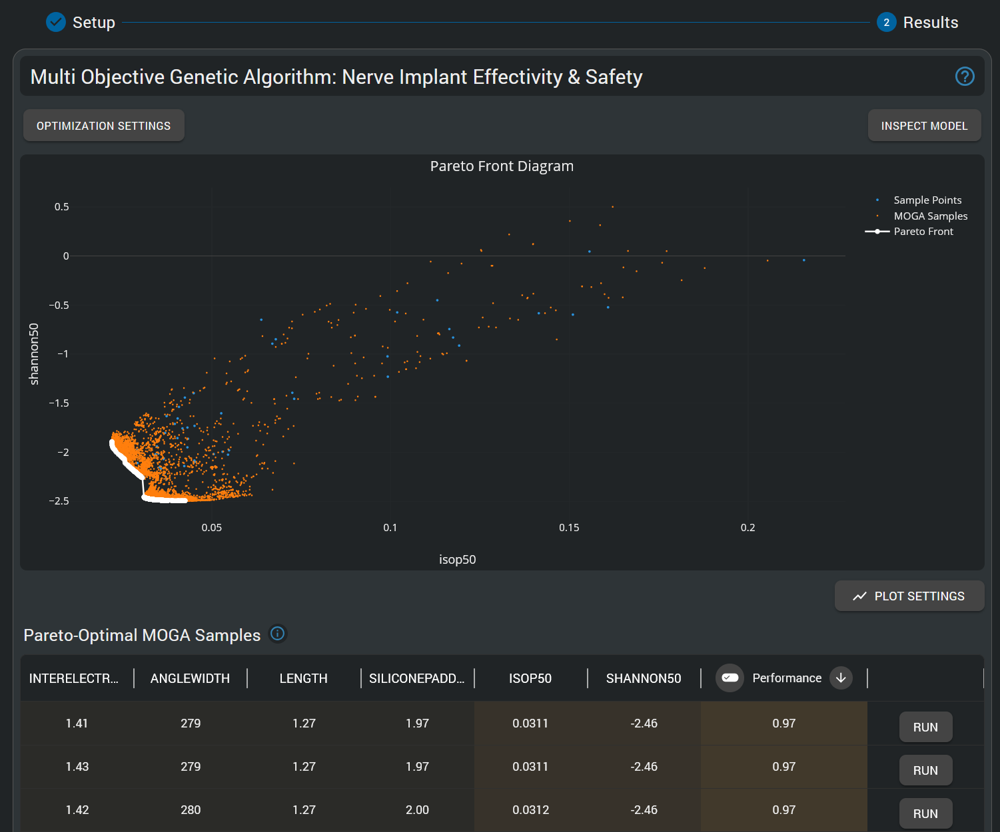
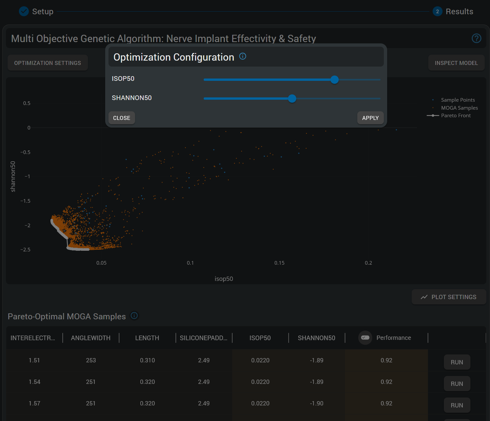

# Multi-Objective Genetic Algorithm (MOGA)

## Introduction

Multi-Objective Genetic Algorithm (MOGA) optimization represents a paradigm shift from traditional single-objective optimization to the systematic exploration of tradeoffs between competing design objectives. Unlike conventional optimization approaches that require subjective weighting of objectives, MOGA discovers the complete Pareto frontier - the set of all optimal solutions where improvement in one objective can only be achieved by accepting degradation in another.

This "model intelligence" approach empowers users to:

- **Discover optimal tradeoffs** between competing objectives without subjective bias
- **Explore the complete Pareto frontier** revealing all achievable performance combinations
- **Make informed engineering decisions** based on quantitative tradeoff analysis
- **Optimize complex systems** with multiple conflicting requirements simultaneously

For bioelectronic applications and other complex engineering domains, where competing objectives like safety and efficacy must be balanced, MOGA enables engineers to systematically discover and quantify the fundamental tradeoffs inherent in their designs. 

This section provides comprehensive guidance on using the Multi-Objective Genetic Algorithm HyperTool Results interface. For detailed information on the Setup step, please refer to the [Setup documentation](setup.md).

## Pareto Frontier Analysis

### Understanding Pareto Optimality

The cornerstone of multi-objective optimization is the concept of Pareto optimality. A solution is Pareto optimal if no other feasible solution exists that improves one or more objectives without degrading any other objective. The collection of all Pareto optimal solutions forms the Pareto frontier (also called Pareto front), representing the best possible tradeoffs available for the given problem.

*Pareto frontier visualization showing optimal tradeoffs between competing objectives. Each point represents a different optimal design configuration where no objective can be improved without degrading another. The frontier shape reveals the fundamental tradeoff relationships between objectives.*

### Pareto Frontier Exploration

**Design Space Insights**
- **Linear Frontier**: Indicates proportional tradeoffs between objectives
- **Curved Frontier**: Reveals non-linear relationships and diminishing returns
- **Extreme Points**: Solutions optimizing single objectives at the expense of others
- **Knee Points**: Solutions offering best compromise between competing objectives
- **Dominated Solutions**: Points below/behind the frontier representing suboptimal designs
- **Infeasible Regions**: Areas where no solutions exist due to physical or practical constraints

**Point Selection and Analysis**
- **Hover analysis** reveals objective values for each solution
- **Solution ranking** enables comparison of multiple candidate designs
- **Hover solution** on the table to highlight corresponding point on the frontier

**Weighted Solution Ranking**

*The MOGA Modeling Intelligence HyperTool integrates solution ranking according to user-defined weights, enabling interactive exploration of tradeoffs. Each entry in the table corresponds to a Pareto optimal solution on the frontier, providing complete parameter specifications for direct implementation. Moreover, the Run button allows users to execute simulations for selected Pareto solutions, facilitating validation and further analysis of optimal designs.*

- **Priority-based sorting** enables systematic evaluation of Pareto solutions based on different objective weightings
- **Parameter transparency** provides complete design specifications for each ranked solution
- **Quantitative comparison** facilitates data-driven selection between competing optimal designs
- **Implementation readiness** delivers parameter values ready for direct design implementation

**Plot Settings**
- **Axis Scaling**: Linear or logarithmic scaling for each objective
- **Dimensionality Type**: 1D, 2D, or 3D objective space visualization
- **Axis Selection**: Choose which objectives to display on each axis

## Genetic Algorithm Configuration

### Algorithm Parameters

*Multi-objective optimization configuration showing configurable optimization hyper-parameters*

The MOGA implementation uses evolutionary algorithms to systematically search the design space and converge to the Pareto frontier. Key algorithmic parameters influence both solution quality and computational efficiency:

- **Population Size**: Number of candidate solutions in each generation (typically 50-200)
- **Number of Iterations**: Maximum number of evolutionary generations performed by the genetic algorithm (typically 50-200)
- **Fitness Type**: Methods for evaluating solution quality through generations.
- **Replacement Strategy**: Options for how new generations replace previous ones
- **Initial Seed**: Random (integer) seed for reproducibility of optimization runs
- **Number of Seeds**: Multiple runs with different seeds for robustness assessment. Uses the initial seed as a base and increments by 1 for each run. Therefore, results are still reproducible by specifying the same initial seed and number of seeds; and increasing the number of seeds will yield additional runs with different seeds while keeping the previous ones identical.

For detailed guidance on the meaning of each of the options in the MOGA configuration, please use the built-in help tooltips available in the HyperTool interface by hovering over the information icons next to each parameter. Furthermore, the *Read More* links provide access to the documentation of the Dakota implementation of the MOGA algorithm, which underpins the Model Intelligence HyperTool.

### Common Multi-Objective Scenarios

**Engineering Design Applications**
- **Safety vs. Performance**: Balance risk mitigation with functional requirements
- **Cost vs. Quality**: Optimize economic efficiency while maintaining standards
- **Speed vs. Accuracy**: Trade computational efficiency against precision
- **Size vs. Capability**: Minimize footprint while maximizing functionality

**Bioelectronic Design Examples**
- **Efficacy vs. Safety**: Therapeutic effectiveness balanced against tissue damage risk
- **Effectivity vs. Longevity**: Battery life optimization with therapeutic dose requirements
- **Selectivity vs. Coverage**: Targeted stimulation balanced with broad therapeutic effect

## Integration with Other Model Intelligence Tools

### Response Surface Modeling Integration

MOGA optimization is performed on surrogate models created through Response Surface Modeling, enabling efficient exploration of complex design spaces. The insights gained from RSM parameter analysis directly inform and enhance MOGA optimization. Furthermore, the same data used to build RSM surrogate models can be leveraged for MOGA optimization, ensuring consistency across analyses and step-by-step data-driven design workflows.

For detailed parameter analysis supporting multi-objective optimization, see the [Response Surface Modeling](response-surface-modeling.md) documentation.

### Uncertainty Quantification Integration

MOGA-discovered Pareto optimal solutions can be assessed for robustness using Uncertainty Quantification, enabling selection of designs that maintain good performance across parameter uncertainty ranges.

For robustness assessment of optimized designs, see the [Uncertainty Quantification](uncertainty-quantification.md) documentation.

### Data-Driven Design Workflow

The combination of RSM, MOGA, and UQ provides a complete Model Intelligence workflow:

1. **RSM** analysis provides parameter understanding and sensitivity insights to guide optimization setup
2. **MOGA** optimization systematically discovers optimal tradeoffs between competing objectives
3. **UQ** assessment validates selected designs for robustness under parameter uncertainty
4. **Iterative Enhancement**: insights from each tool enable targeted refinement and improved analysis confidence across all tools simultaneously.