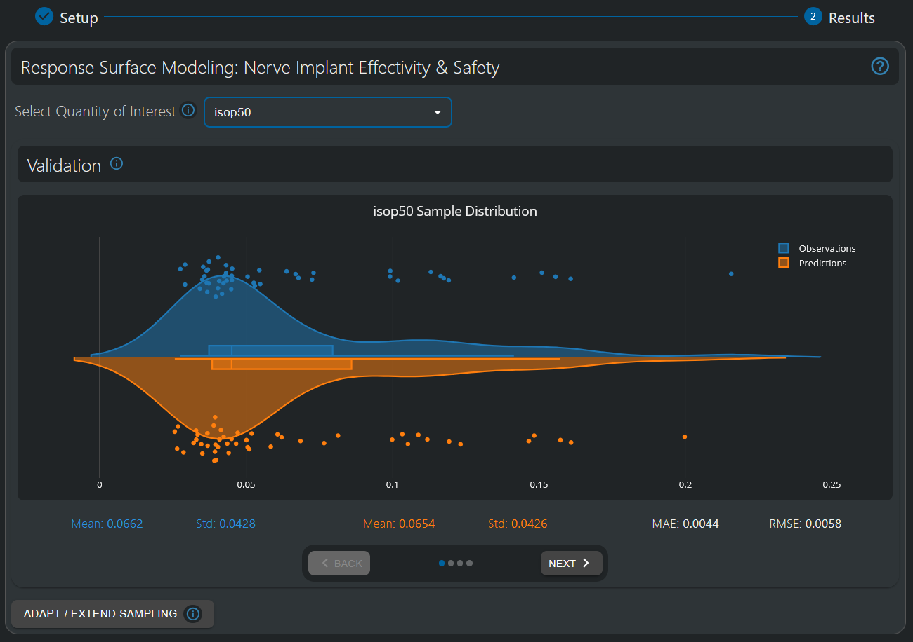
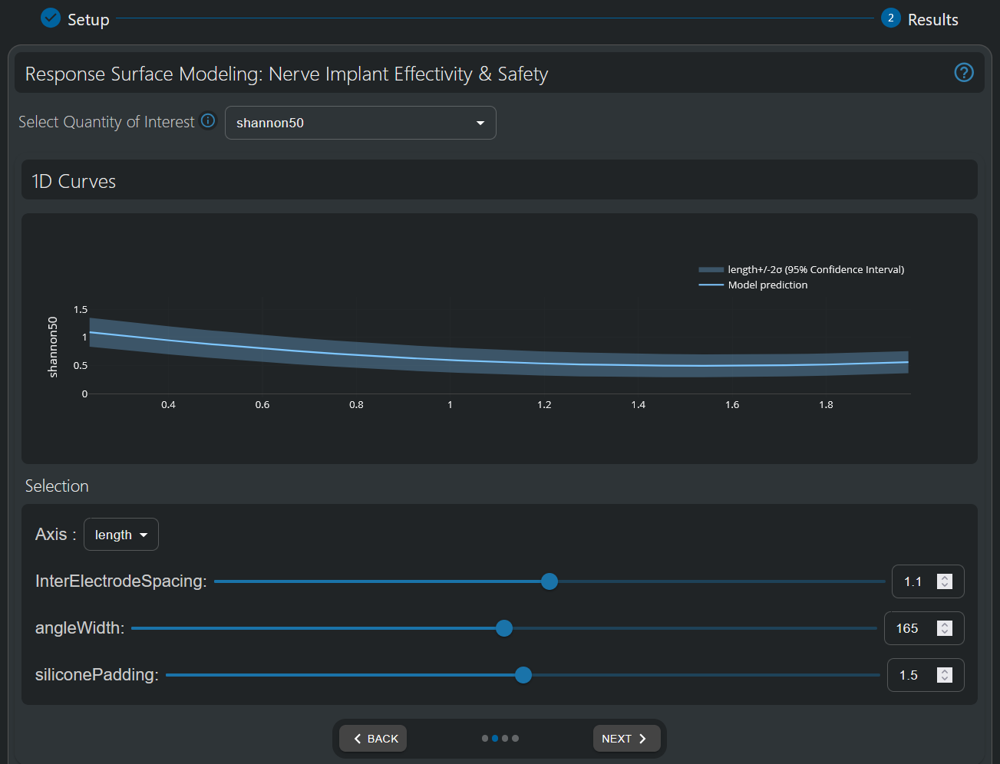
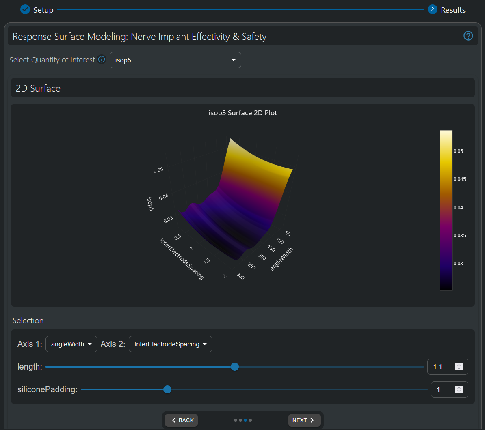
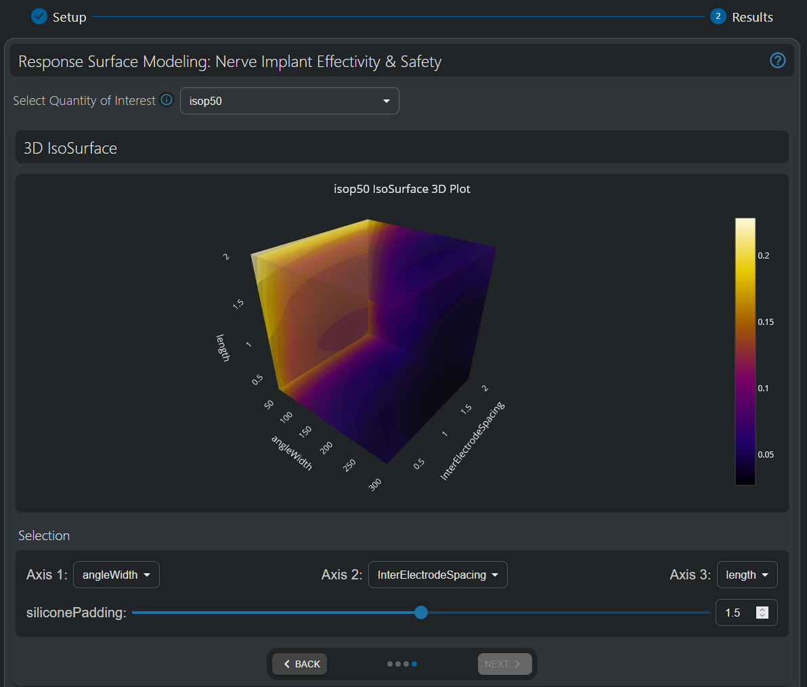
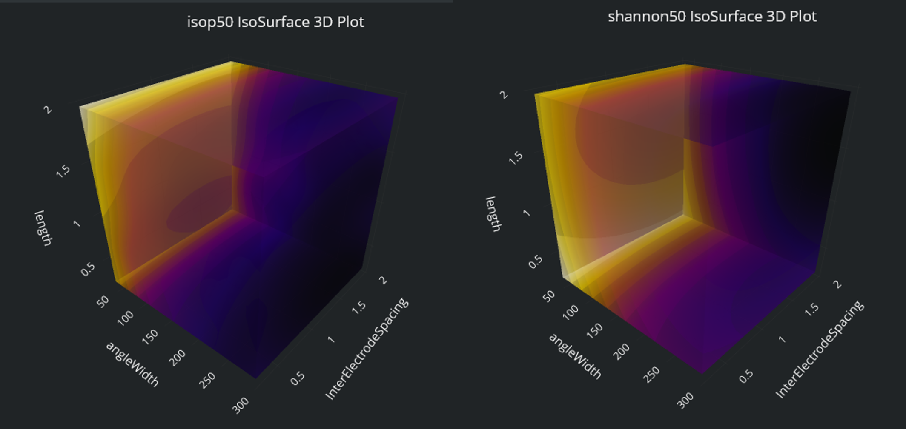

# Response Surface Modeling

## Introduction

Response Surface Modeling (RSM) represents a paradigm shift in simulation analysis, creating simplified mathematical models (also known as surrogate models or metamodels) that approximate complex system behavior. By transforming computationally expensive simulations into rapid mathematical representations, RSM enables extensive parameter space exploration that would otherwise require thousands of time-consuming simulations.

This "model intelligence" approach empowers users to:

- **Gain deeper insights** into parameter dependencies and complex relationships
- **Optimize designs efficiently** through rapid evaluation of design alternatives  
- **Quantify uncertainties** with statistical confidence measures
- **Make data-driven decisions** with unprecedented computational speed
- **Extract maximum value** from simulation models while dramatically reducing computational overhead

For bioelectronic applications and other complex engineering domains, where multiple parameters interact in non-obvious ways, metamodeling transforms raw simulation data into actionable knowledge - revealing relationships between inputs and outcomes that might remain hidden in traditional simulation approaches.

This section provides comprehensive guidance on using the Response Surface Modeling HyperTool Results interface. For detailed information on the Setup step, please refer to the [Setup documentation](setup.md).

## Model Quality Validation

### Surrogate Model Validation Overview

Before utilizing a surrogate model for analysis, the Response Surface Modeling HyperTool provides comprehensive validation tools to assess model quality and reliability. The validation process uses Cross-Validation techniques, where the model is trained on a subset of data and tested on hidden samples to provide confidence estimates.

*Violin plot validation comparing ground-truth observations (top) with cross-validation predictions (bottom). The similarity of the distributions and the magnitude of the error metrics (with respect to the variability present in the data, represented by the standard deviation) indicate model quality-of-fit.*

### Violin Plot Validation Interface

**Distribution Comparison**
- **Top Violin**: Shows the distribution of actual simulation results (ground-truth observations)
- **Bottom Violin**: Displays the distribution of cross-validation predictions
- **Shape Analysis**: Similar violin shapes indicate that the model is able to accurately reproduce the distribution of the underlying data
- **Whisker Plot Analysis**: Similarity across median, Q1, Q3 and whisker values of each distribution provide additional information about the degree of accuracy with which the surrogate model reproduces the distribution of the underlying data

**Statistical Metrics Panel**
- **Mean (Observations)**: Average value in the ground-truth data
- **Standard Deviation (Observations)**: Variability in the ground-truth data
- **Mean (Predictions)**: Average value of cross-validation predictions  
- **Standard Deviation (Predictions)**: Variability of cross-validation predictions
- **Mean Absolute Error (MAE)**: Average magnitude of prediction errors
- **Root Mean Square Error (RMSE)**: Weighted error metric emphasizing larger deviations

## Visualization and Analysis Tools

The Response Surface Modeling HyperTool provides three primary visualization modes for exploring parameter dependencies: 1D Curves, 2D Surfaces, and 3D Iso-Surfaces. Each visualization offers unique insights into how input parameters influence your quantities of interest.

### 1D Curve Response Analysis

*One-dimensional parameter dependency visualizations showing the response of the output quantity in the Y axis with respect one input parameter (in the X axis). Additionally, the 95% Confidence Interval around the prediction (i.e. mean ± twice the standard deviation) provides the degree of confidence of the model in the predicted values.*

#### Interface Components

**Main Plot Area**
- **X-Axis**: Selected input parameter range (configurable via dropdown)
- **Y-Axis**: Quantity of Interest (QoI) values (selectable from available outputs at the top dropdown)
- **Blue Line**: Mean prediction from the surrogate model
- **Shaded Area**: 95% confidence interval (mean ± 2 standard deviations)
- **Parameter Sliders**: Interactive controls for fixing non-displayed parameters
  - Slider bars for continuous adjustment
  - Text boxes for precise value entry
  - Up/down arrows at the text boxes for incremental changes

**Uncertainty (shaded area) Interpretation**
- **Gaussian Process Confidence**: The shaded area represents model uncertainty, not data variability
- **Narrow Bands**: High confidence in model predictions
- **Wide Bands**: Lower confidence, potentially requiring additional sampling
- **95% Confidence**: Probability that a new simulation would fall within the shaded region

#### Analysis Guidelines
- Look for clear trends that exceed uncertainty bounds
- Identify optimal parameter ranges where QoI is minimized/maximized
- Note inflection points and non-linear relationships
- Compare effect magnitudes across different parameters

*Comparative 1D analysis showing how angle width and length parameters affect both efficiency (50% isopercentile current) and safety (Shannon Criteria) of the Sural Nerve Pain Relief Neural Implant Design Optimization Tutorial, demonstrating the trade-offs in bioelectronic device design.*

### 2D Surface Response Analysis

*Two-dimensional response surface showing the 50% isopercentile threshold as a function of angle width and inter-electrode spacing.*

#### Interface Elements

**Surface Plot Display**
- **Color Mapping**: Continuous color scale representing QoI values
  - Blue/Purple: Lower values
  - Green/Yellow: Medium values  
  - Red: Higher values
- **Contour Lines**: Iso-value lines for precise level identification
- **Smooth Interpolation**: Gaussian Process predictions between sample points
- **Interactive Rotation**: 3D perspective controls for optimal viewing
- **Colorbar Scale**: Legend showing QoI value ranges and color mapping

**Parameter Control Panel**
- **Axis Dropdowns**: Select parameters for horizontal axes
- **Fixed Parameter Sliders**: Control values for remaining parameters

#### Interpretation Strategies
- **Identify Optimal Regions**: Areas with desired QoI values (e.g., minima for safety criteria)
- **Understand Interactions**: How two parameters jointly influence outcomes
- **Spot Gradients**: Steep color changes indicate high sensitivity
- **Find Trade-offs**: Regions where improvement in one metric degrades another

### 3D Iso-Surface Analysis

*Three-dimensional iso-surface visualization revealing parameter interactions across three input parameters simultaneously.*

#### 3D Visualization Components

**Iso-Surface Display**
- **Semi-Transparent Surfaces**: Multiple iso-value levels shown simultaneously
- **Color-Coded Levels**: Different colors represent different QoI threshold values
- **Smooth Geometry**: Continuous surfaces generated from Gaussian Process predictions

**Interactive Controls**
- **3D Rotation**: Mouse-driven rotation for comprehensive viewing angles
- **Zoom/Pan**: Scroll and drag controls for detailed examination
- **Parameter Selection**: Three dropdown menus for axis assignment
- **Fixed Parameter Controls**: Sliders for remaining input parameters

#### Complex Interaction Analysis
- **Multi-Parameter Effects**: Understand how three parameters simultaneously influence outputs
- **Design Space Boundaries**: Identify feasible regions meeting multiple constraints
- **Optimization Paths**: Visualize trajectories toward optimal solutions
- **Sensitivity Hotspots**: Locate regions where small parameter changes cause large output variations

*Side-by-side 3D comparison of efficiency (left - 50% isopercentile threshold) and safety (right - Shannon Criteria) iso-surfaces, enabling multi-objective design optimization.*

## Integration with Other Model Intelligence Tools

### Multi-Objective Optimization Integration

Response Surface Modeling provides the foundation for advanced multi-objective optimization workflows. The insights gained from RSM parameter analysis directly inform and enhance multi-objective genetic algorithm (MOGA) optimization. Furthermore, the same data used to build RSM surrogate models can be leveraged for MOGA optimization, ensuring consistency across analyses and step-by-step data-driven design workflows.

For systematic multi-objective optimization building on RSM insights, see the [Multi-Objective Genetic Algorithm (MOGA)](multi-objective-genetic-algorithm.md) documentation.

### Uncertainty Quantification Integration

RSM surrogate models, or automatic optimization on them through the MOGA algorithm, enable data-driven selection of design parameters. Uncertainty Quantification further enables assessment of the robustness of these design choices under parameter variability.

For comprehensive uncertainty analysis based on RSM-informed design choices, see the [Uncertainty Quantification](uncertainty-quantification.md) documentation.

### Data-Driven Design Workflow

The combination of RSM, MOGA, and UQ provides a complete Model Intelligence workflow:

1. **RSM** visualization provides deeper understanding into parameter dependencies and allows identification of key relationships and output sensitivities
2. **MOGA**: optimization over the full design space allows systematic exploration and data-driven optimal tradeoffs between competing objectives
3. **UQ**: design choices can be assessed for robustness and reliability under parameter uncertainty
4. **Iterative Refinement**: insights from each tool provide further refinement for each other. Furthermore, additional data can be collected in targeted regions to improve surrogate model quality and analysis confidence, improving the accuracy of results across all tools simultaneously.

