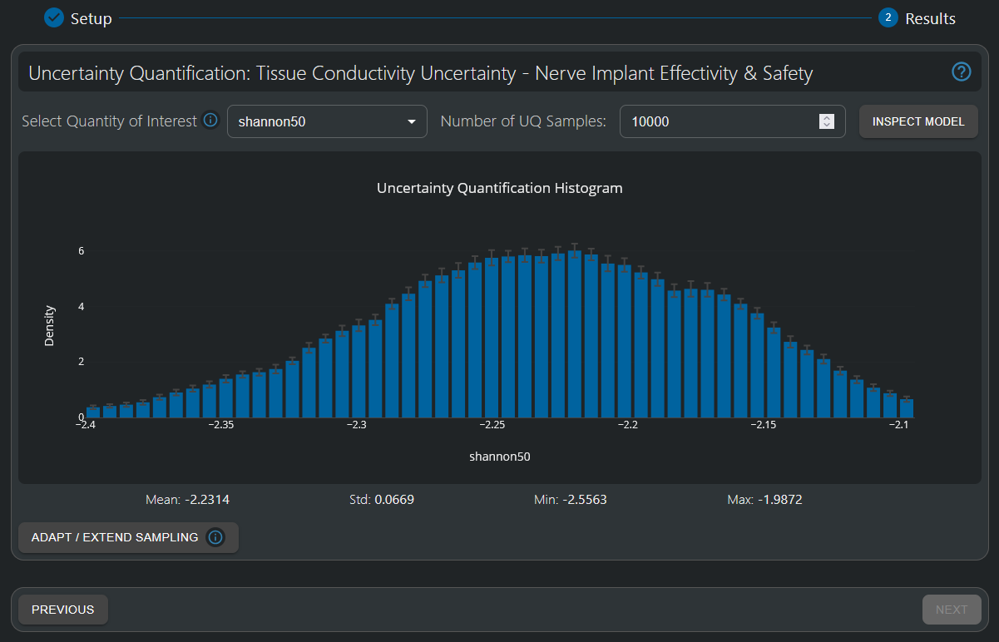

# Uncertainty Quantification

## Introduction

Uncertainty Quantification (UQ) represents a transformative approach to understanding and quantifying the reliability of simulation results under parameter uncertainty. This Model Intelligence capability enables engineers and researchers to efficiently demonstrate the statistical reliability of their designs across physiologically relevant parameter ranges - a critical requirement for regulatory submission and clinical translation of complex systems.

Traditional sensitivity analysis approaches become computationally prohibitive when investigating the interplay between multiple uncertain parameters. For example, analyzing just 6 parameters with a minimal 3 samples per parameter would require over 700 simulations. The Uncertainty Quantification HyperTool addresses this challenge through an innovative methodology:

1. **Efficient Sampling**: Generate a low-density sampling of the parameter space (typically 50-100 samples)
2. **Surrogate Modeling**: Fit a high-fidelity metamodel to the sampled simulation data
3. **Monte Carlo Propagation**: Use the surrogate to efficiently evaluate thousands of parameter combinations
4. **Statistical Analysis**: Produce rigorous statistical descriptions accounting for complex parameter interactions

This approach provides more comprehensive uncertainty estimation than traditional single-parameter sensitivity analyses while dramatically reducing computational overhead. By transforming deterministic simulation workflows into probabilistic design validation frameworks, UQ enables statistically sound decision-making that accounts for real-world variability and uncertainty.

Please refer to the [Using Model Intelligence HyperTools](hypertool-creation.md) and [Setup](setup.md) sections of this manual for more information on how to create and setup an Uncertainty Quantification HyperTool. This section will focus on Results (step 2) interpretation and analysis.

## Uncertainty Propagation Analysis

### Statistical Results Visualization

The primary output of uncertainty quantification is a comprehensive statistical characterization of output quantities under input parameter uncertainty:

*Uncertainty Quantification Histogram showing the statistical distribution of an output quantity-of-interest, demonstrating design robustness despite significant input parameter uncertainty.*

#### Histogram Analysis Interface

**Statistical Distribution Display**
- **Histogram Bars**: Frequency distribution of output values across uncertainty space
- **Probability Density**: Continuous curve showing probability density function
- **Distribution Shape**: Visual assessment of normality, skewness, and modality
- **Convergence Indicators**: Error bars showing Monte Carlo convergence

**Statistical Metrics Panel**
- **Mean Value**: Expected value of the output quantity under uncertainty
- **Standard Deviation**: Measure of output variability due to input uncertainties
- **Confidence Intervals**: 1% and 99% quantiles of output predictions as the histogram limits
- **Minimum and Maximum Values**: Minimum and Maximum output values found across the thousands of parameter combinations

#### Interpretation Guidelines

**Robustness Assessment**
- **Low Sensitivity**: Output standard deviation << input standard deviations indicates robust design
- **High Sensitivity**: Large output uncertainty suggests need for tighter parameter control
- **Distribution Shape**: Distribution shapes different from those of the input parameters may indicate threshold effects or nonlinearities

**Design Validation**
- **Safety Margins**: Ensure 95% and 99% confidence intervals maintain acceptable performance
- **Regulatory Compliance**: Use statistical bounds for safety and efficacy demonstrations
- **Risk Assessment**: Quantify probability of exceeding critical thresholds

## Model Quality Validation

### Surrogate Model Assessment

The accuracy of uncertainty quantification critically depends on the quality of the underlying surrogate model. The HyperTool provides validation under the *Inspect Model* button at the top right of the interface.

Furthermore, one / two / three-dimension visualization of input parameter dependencies on the output quantity are provided, enabling further insights. Please refer to the [Response Surface Modeling](response-surface-modeling.md) section of this Manual for further information.

### Quality Assurance Workflow

1. **Model Validation**: Always check the surrogate model quality before interpreting UQ results
2. **Cross-Validation**: Review validation metrics to ensure adequate model accuracy
3. **Visual Inspection**: Use response surface visualizations to verify model behavior
4. **Sensitivity Check**: Compare UQ results with expected parameter sensitivities

## Integration with Other Model Intelligence Tools

### Response Surface Modeling Integration

Uncertainty Quantification builds directly on Response Surface Modeling capabilities, using RSM surrogate models for efficient uncertainty propagation and parameter sensitivity understanding.

For detailed parameter analysis supporting uncertainty quantification, see the [Response Surface Modeling](response-surface-modeling.md) documentation.

### Multi-Objective Optimization Integration

Uncertainty Quantification provides critical robustness assessment for multi-objective optimization results, helping select robust designs from the Pareto frontier and quantifying performance variability under parameter uncertainty.

For systematic multi-objective optimization with uncertainty considerations, see the [Multi-Objective Genetic Algorithm (MOGA)](multi-objective-genetic-algorithm.md) documentation.

### Data-Driven Design Workflow

The combination of RSM, MOGA, and UQ provides a complete Model Intelligence workflow:

1. **RSM** analysis establishes parameter relationships and builds high-quality surrogate models
2. **MOGA** optimization identifies optimal design tradeoffs and Pareto frontier solutions
3. **UQ** validation assesses robustness and reliability of selected designs under uncertainty
4. **Iterative Enhancement**: insights from each tool enable refinement and targeted data collection to improve analysis confidence across all tools simultaneously.
