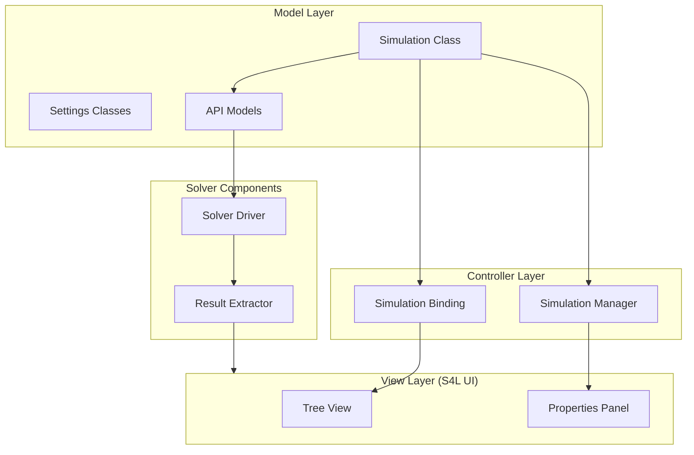

# Plugin Structure Overview

The S4L Plugin Framework follows a clear architectural pattern that separates concerns and provides a structured approach to simulation development. This overview explains the high-level organization of the plugin framework.

## Architecture

The plugin framework follows a Model-View-Controller (MVC) pattern with the following components:



## Core Components

### Model Layer

The model layer represents the structure and data of your simulation:

- **Simulation Class**: The central container for all simulation components
- **Settings Classes**: Specialized classes for different types of settings (materials, boundaries, etc.)
- **API Models**: Data transfer objects that connect the UI model to the solver

### Controller Layer

The controller layer handles UI interaction and connects the model to the view:

- **Simulation Binding**: Maps the model structure to the tree view hierarchy
- **Simulation Manager**: Handles UI actions and property panel updates

### Solver Components

The computational part of the plugin:

- **Solver Driver**: Implements the numerical algorithms to run the simulation
- **Result Extractor**: Processes simulation results for visualization

## Directory Structure

A typical plugin has the following directory structure:

```
plugin-name/
├── LICENSE
├── README.md
├── setup.py
├── src/
│   └── package_name/
│       ├── __init__.py
│       ├── register.py         # Plugin registration point
│       ├── controller/         # UI controller components
│       │   ├── __init__.py
│       │   ├── simulation_binding.py
│       │   └── simulation_manager.py
│       ├── model/              # Simulation model components
│       │   ├── __init__.py
│       │   ├── simulation.py   # Main simulation class
│       │   ├── *_settings.py   # Various settings classes
│       │   └── simulation_extractor.py
│       └── solver/             # Solver implementation
│           ├── __init__.py
│           ├── driver/
│           │   ├── __init__.py
│           │   ├── api_models.py
│           │   └── main.py     # Solver implementation
└── tests/                      # Test cases
    └── test_simulation.py
```

## Plugin Registration Flow

When S4L loads your plugin, the following sequence occurs:

1. The entry point defined in `setup.py` is discovered
2. The `register()` function in your plugin's `register.py` is called
3. Your plugin registers its simulation type, binding factory, and manager factory
4. S4L makes your simulation type available in the interface

## Next Steps

To understand each component in more detail:

- [Entry Points](entry-points.md): Learn how plugins register with S4L
- [Tree Structure](tree-structure.md): Understand how the tree view is constructed