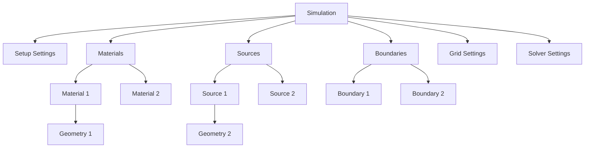

# Tree Structure

One of the most important aspects of the S4L Plugin Framework is the tree-based UI representation of your simulation. This page explains how the tree structure works and how to define the tree hierarchy.

## Tree Hierarchy Overview

The S4L UI represents simulations as a hierarchical tree, with the simulation as the root and various settings components as branches and leaves:



This hierarchical structure makes it easy for users to navigate and configure simulation components.

## Simulation Binding

The tree structure is defined by the `SimulationBinding` class. This class maps the hierarchical structure of your simulation model to the tree structure displayed in the UI.

The main responsibilities of the `SimulationBinding` class are:

1. Define how many child nodes exist at each level in the tree
2. Map tree paths to actual simulation component objects

### Counting Children

The `count_children` method determines how many child nodes should be displayed at a given tree path:

```python
def count_children(self, path: list[int]) -> int:
    """
    Determines the number of child nodes at a specific tree path location.
    
    Args:
        path: The tree path as a list of integer indices
        
    Returns:
        Number of children at the specified path
    """
    simulation = self.simulation

    # Standard structure
    if len(path) == 2:  # Top level simulation node showing settings categories
        return 6  # Setup, Materials, Sources, Boundary Conditions, Grid, Solver

    if len(path) == 3:
        if path[2] in (0, 4, 5):  # Setup, Grid, Solver
            return 0  # these settings have no children
        elif path[2] == 1:
            return len(simulation.material_settings.elements)
        elif path[2] == 2:
            return len(simulation.source_setings.elements)
        elif path[2] == 3:
            return len(simulation.boundary_settings.elements)
        else:
            raise RuntimeError(f"Invalid path: {path}")

    # Additional levels...
    # ...
```

### Mapping Tree Paths

The `get_tree_item` method maps tree paths to the actual simulation components:

```python
def get_tree_item(self, path: list[int]) -> "TreeItem | None":
    """
    Retrieves the specific simulation component at the given tree path.
    
    Args:
        path: The tree path as a list of integer indices
        
    Returns:
        The tree item at the specified path or None if the path is invalid
    """
    simulation = self.simulation

    if len(path) == 2:
        return simulation

    if path[2] == 0:
        sim_child = simulation.setup_settings
    elif path[2] == 1:
        sim_child = simulation.material_settings
    elif path[2] == 2:
        sim_child = simulation.source_setings
    elif path[2] == 3:
        sim_child = simulation.boundary_settings
    elif path[2] == 4:
        sim_child = simulation.grid_settings
    elif path[2] == 5:
        sim_child = simulation.solver_settings
    else:
        return None

    if len(path) == 3:
        return sim_child

    # More specific path handling...
    # ...
```

## Understanding Tree Paths

A tree path is a list of integers that defines the navigation path from the root to a particular node:

- `[0]` - Root document node (not visible)
- `[0, 0]` - Document node (usually showing document info)
- `[0, 0, i]` - Simulation nodes at the top level (i is the simulation index)
- `[0, 0, i, 0]` - First-level simulation children (i is the simulation index)

For a typical simulation, the path structure would be:

- `[0, 0, i]` - The simulation itself
- `[0, 0, i, 0]` - Setup Settings
- `[0, 0, i, 1]` - Materials Collection
- `[0, 0, i, 1, j]` - Material j
- `[0, 0, i, 1, j, k]` - Geometry k assigned to Material j
- `[0, 0, i, 2]` - Sources Collection
- And so on...

## Collections and Groups

Most simulation components are organized into collections (like Materials, Sources, Boundaries). The framework provides a `Group` base class to manage collections of similar items:

```python
class Materials(Group[MaterialSettings]):
    """Collection class that manages a group of MaterialSettings objects."""

    def __init__(
        self, parent: "TreeItem", is_expanded: bool = True, icon: str = ""
    ) -> None:
        super().__init__(
            parent,
            MaterialSettings,  # Item type for this collection
            is_expanded,
            icon="icons/XMaterials/materials.ico",
        )

    def _get_new_element_description(self) -> str:
        """Base name for new elements."""
        return "Material"

    @property
    def description_text(self) -> str:
        """Display text in the tree."""
        return "Materials"
```

The `Group` class provides standard functionality for collections, including:
- Adding/removing elements
- Accessing elements by index
- Iterating over elements
- Managing UI state (expanded/collapsed)

## Customizing Tree Structure

When creating your own plugin, you can customize the tree structure by:

1. Defining your own settings components and collections
2. Implementing a custom `SimulationBinding` class that maps your components to the tree
3. Organizing your settings logically based on your simulation's needs

## Next Steps

Now that you understand how the tree structure works, learn about:

- [Creating a Simulation Class](../creating-a-plugin/creating-simulation.md): Define your simulation's core class
- [Defining Settings](../creating-a-plugin/defining-settings.md): Create settings components for your simulation