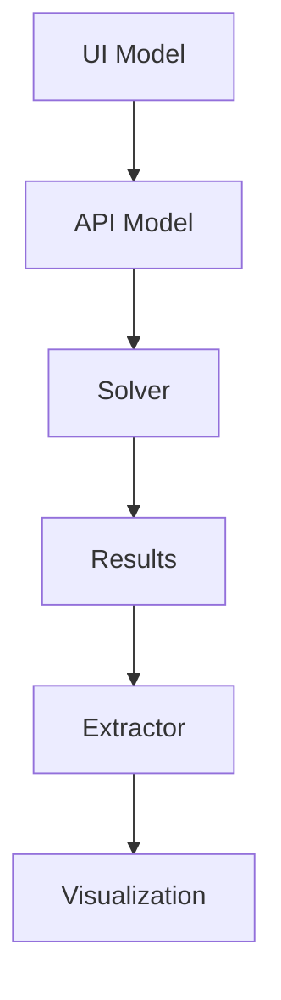
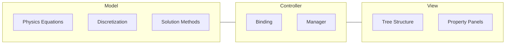

<!-- filepath: /home/guidon/devel/src/gitlab/sim4life/plugins/template/documentation/docs/simulation-models/overview.md -->
# Simulation Models Overview

Simulation models are the heart of your S4L plugin, representing the physical phenomena you want to simulate. These models define the mathematical equations, their discretization, and solution approach for your specific physical problem.

## What is a Simulation Model?

A simulation model in the S4L Plugin Framework consists of:

1. **Mathematical Model**: The underlying physics equations to be solved
2. **Discretization Approach**: How the continuous equations are converted to discrete form
3. **Solution Methods**: Algorithms used to solve the resulting systems
4. **Parameters**: Physical and numerical parameters that define the problem
5. **Results**: Output quantities that represent the solution

## Architecture of a Simulation Model

The simulation model architecture in S4L follows a clear separation of concerns:

- **UI Model**: Defines the user interface structure for setting up the simulation
- **API Model**: A clean representation of all parameters needed by the solver
- **Solver**: Implements the numerical algorithms that solve the equations
- **Results**: Raw output data from the solver
- **Extractor**: Processes raw results into visualization-ready formats
- **Visualization**: Presents the results to the user

## Model Interfaces

The simulation model exposes several key interfaces:

1. **`as_api_model()`**: Converts the UI model to an API model for the solver
2. **`validate()`**: Verifies that the simulation is properly configured
3. **`register_extractor()`**: Connects the simulation to visualization tools
4. **`get_solver_src()`**: Specifies the solver implementation to use

## Example: Heat Conduction Model

The heat conduction model exemplifies a complete simulation model:

### Physical Equations

The steady-state heat conduction equation:

$$\nabla \cdot (k \nabla T) + Q = 0$$

Where:
- $T$ is the temperature field
- $k$ is the thermal conductivity
- $Q$ is the volumetric heat source

### Model Components

The heat conduction model includes:

- **Material Settings**: Define thermal conductivity values for different regions
- **Source Settings**: Define heat sources and their properties
- **Boundary Settings**: Define temperature constraints at domain boundaries
- **Grid Settings**: Define spatial discretization
- **Solver Settings**: Define numerical solution parameters

## Model-View Separation

The Sim4Life Plugin Framework emphasizes separation between the model (physics implementation) and view (UI representation):

This clean separation allows:

1. Independent testing of the physics implementation
2. Flexibility in UI representation without changing the underlying model
3. Reuse of solver components across different simulations

## Next Steps

To implement your own simulation model:

- [Physics Models](physics-models.md): Define the equations and parameters for your physical system
- [Writing a Solver](../solver-implementation/writing-solver.md): Implement the numerical solution algorithms