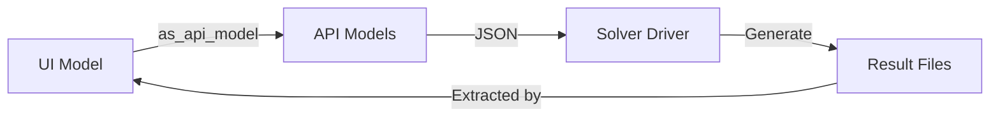

# Writing a Solver

The solver is where the actual physics computations happen in your simulation plugin. This page explains how to implement a solver for your plugin, covering the overall structure, key components, and best practices.

## Solver Architecture

The S4L Plugin Framework uses a clean separation between the UI model and the solver. This is done through:

1. **API Models**: Simple data transfer objects that pass simulation parameters to the solver
2. **Solver Driver**: The main implementation of your numerical solver
3. **Command-Line Interface**: A standardized input/output mechanism

This architecture allows the solver to run as a separate process, making it more robust and independent of the UI.



## Solver Location

Your solver implementation should be located in the `solver/driver` package of your plugin:

```
src/
└── my_package_name/
    └── solver/
        ├── __init__.py
        └── driver/
            ├── __init__.py
            ├── api_models.py  # Data transfer objects
            └── main.py        # Main solver implementation
```

## Command-Line Interface

The solver is executed as a separate process with a standardized command-line interface:

```
python -m my_package_name.solver.driver.main -i input_file.json -o output_folder
```

You can customize how the solver process is launched by overriding the `solver_backend` method in your simulation class (see [Creating a Plugin](../creating-a-plugin/creating-simulation.md)). By default, this method returns the backend type and no additional configuration:

```python
def solver_backend(self) -> tuple[SolverBackend, config_type_t | None]:
    """
    Specifies which type of solver backend to use for running this simulation.
    Returns:
        A tuple containing the solver backend type and optional configuration
    """
    return SolverBackend.PROCESS, None
```

You can partially override this to provide a custom process configuration. For example:

```python
def solver_backend(self) -> tuple[SolverBackend, config_type_t | None]:
    config = {
        "cmd": [source_script, "&&", mpi_prefix, f"/usr/bin/python3", str(solver_entry_point), "-i", str(inputs_dir), "-o", str(outputs_dir)],
        "cwd": "/my_driver",
        "env": {"OMP_NUM_THREADS": "1"}
    }
    return SolverBackend.PROCESS, config
```

This allows you to control the command, working directory, and environment variables used to launch the solver process.

Your `main.py` should parse these arguments and handle input/output accordingly:

```python
import argparse
import json
import logging
import os
import sys

def main():
    # --- CLI Argument Parsing ---
    parser = argparse.ArgumentParser(description="My Physics Solver")
    parser.add_argument(
        "-i",
        "--inputfile",
        type=str,
        required=True,
        help="Path to simulation input JSON file"
    )
    parser.add_argument(
        "-o", 
        "--outputfolder", 
        type=str, 
        required=True, 
        help="Path to output folder"
    )
    args = parser.parse_args()

    # --- Setup Logging ---
    input_path = os.path.abspath(args.inputfile)
    output_dir = os.path.abspath(args.outputfolder)
    os.makedirs(output_dir, exist_ok=True)
    log_path = os.path.join(output_dir, "solver.log")

    # Configure logging
    logger = configure_logging(log_path)
    
    # --- Load Input Model ---
    logger.info("Loading input model from %s", input_path)
    with open(input_path, "r") as f:
        sim = Simulation.from_json(f.read())
    
    # --- Run Solver ---
    logger.info("Starting solver...")
    results = run_solver(sim, logger)
    
    # --- Save Results ---
    logger.info("Saving results to %s", output_dir)
    save_results(results, output_dir)
    
    logger.info("Solver completed successfully")

if __name__ == "__main__":
    main()
```

## Input Handling

Your solver should load the input model from the provided JSON file:

```python
def load_input_model(input_path: str) -> api_models.Simulation:
    """Load the simulation model from the input JSON file."""
    with open(input_path, "r") as f:
        sim = api_models.Simulation.from_json(f.read())
    return sim
```

## Solver Implementation

The core of your solver will be the implementation of your physics equations. Here's a simplified example for a heat conduction solver:

```python
def run_solver(sim: api_models.Simulation, logger: logging.Logger) -> dict:
    """Run the solver algorithm and return the results."""
    # Extract parameters from the simulation model
    material = sim.material_settings[0]
    grid = sim.grid_settings
    solver_settings = sim.solver_settings
    
    # Log configuration summary
    logger.info("Thermal conductivity: %f W/mK", material.thermal_conductivity)
    logger.info("Grid spacing: dx=%f, dy=%f, dz=%f", grid.dx, grid.dy, grid.dz)
    logger.info("Solver: method=%s, tol=%e, max_iter=%d", 
                solver_settings.solver_method, 
                solver_settings.tolerance, 
                solver_settings.max_iter)
    
    # Create computational grid
    nx = int((material.xmax - material.xmin) / grid.dx) + 1
    ny = int((material.ymax - material.ymin) / grid.dy) + 1
    nz = int((material.zmax - material.zmin) / grid.dz) + 1
    
    # Initialize fields
    temperature = np.zeros((nx, ny, nz))
    sources = np.zeros((nx, ny, nz))
    
    # Apply sources
    for src in sim.source_setings:
        i = int((src.x - material.xmin) / grid.dx)
        j = int((src.y - material.ymin) / grid.dy)
        k = int((src.z - material.zmin) / grid.dz)
        if 0 <= i < nx and 0 <= j < ny and 0 <= k < nz:
            sources[i, j, k] = src.volumetric_heat_source
    
    # Apply boundary conditions
    # ... (code to apply boundary conditions)
    
    # Solve the system
    temperature = solve_heat_equation(
        temperature, 
        sources, 
        material.thermal_conductivity,
        grid.dx,
        solver_settings.tolerance,
        solver_settings.max_iter,
        logger
    )
    
    # Compute derived quantities (e.g., heat flux)
    heat_flux = compute_heat_flux(temperature, material.thermal_conductivity, grid.dx)
    
    # Return results
    return {
        "temperature": temperature,
        "heat_flux": heat_flux,
        "grid": {
            "nx": nx, "ny": ny, "nz": nz,
            "dx": grid.dx, "dy": grid.dy, "dz": grid.dz,
            "xmin": material.xmin, "ymin": material.ymin, "zmin": material.zmin,
            "xmax": material.xmax, "ymax": material.ymax, "zmax": material.zmax
        }
    }
```

## Output Generation

Your solver should generate standardized output files that can be read by the extractor:

```python
def save_results(results: dict, output_dir: str) -> None:
    """Save the solver results to files in the output directory."""
    # Save a summary JSON with key statistics
    summary = {
        "min_temperature": float(np.min(results["temperature"])),
        "max_temperature": float(np.max(results["temperature"])),
        "mean_temperature": float(np.mean(results["temperature"])),
        "total_heat_input": float(np.sum(results["sources"]))
    }
    
    with open(os.path.join(output_dir, "summary.json"), "w") as f:
        json.dump(summary, f, indent=2)
    
    # Save temperature field as VTK file
    save_vtk_rectilinear_grid(
        results["temperature"],
        "Temperature",
        results["grid"],
        os.path.join(output_dir, "Temperature.vtr")
    )
    
    # Save heat flux field as VTK file
    save_vtk_vector_field(
        results["heat_flux"],
        "HeatFlux",
        results["grid"],
        os.path.join(output_dir, "HeatFlux.vtr")
    )
```

## Using VTK for Output

The S4L framework expects results in VTK format. You can use libraries like PyVista to generate these files:

```python
def save_vtk_rectilinear_grid(data, data_name, grid, output_path):
    """Save a scalar field as a VTK rectilinear grid file."""
    import pyvista as pv
    
    # Create coordinates for the rectilinear grid
    x = np.linspace(grid["xmin"], grid["xmax"], grid["nx"])
    y = np.linspace(grid["ymin"], grid["ymax"], grid["ny"])
    z = np.linspace(grid["zmin"], grid["zmax"], grid["nz"])
    
    # Create the grid and add the data
    vtk_grid = pv.RectilinearGrid(x, y, z)
    vtk_grid.point_data[data_name] = data.flatten(order="F")
    
    # Save to file
    vtk_grid.save(output_path)
```

## Error Handling

Your solver should handle errors gracefully:

```python
def solve_heat_equation(temperature, sources, k, dx, tol, max_iter, logger):
    """Solve the heat equation using an iterative method."""
    try:
        # Solver implementation
        # ...
        
        return temperature
    except Exception as e:
        logger.error("Solver failed: %s", str(e))
        logger.exception(e)
        raise RuntimeError(f"Solver failed: {str(e)}")
```

## Logging

Use detailed logging to help users understand what's happening:

```python
def configure_logging(log_path):
    """Configure logging to both file and console."""
    logger = logging.getLogger()
    logger.setLevel(logging.INFO)
    
    # Clear existing handlers
    logger.handlers = []
    
    # Create formatters and handlers
    formatter = logging.Formatter("%(asctime)s - %(levelname)s - %(message)s")
    
    # File handler
    file_handler = logging.FileHandler(log_path)
    file_handler.setFormatter(formatter)
    logger.addHandler(file_handler)
    
    # Console handler
    console_handler = logging.StreamHandler(sys.stdout)
    console_handler.setFormatter(formatter)
    logger.addHandler(console_handler)
    
    return logger
```

---

## Next Steps

- [API Models](api-models.md)
- [Results Extractors Overview](../extractors/overview.md)
