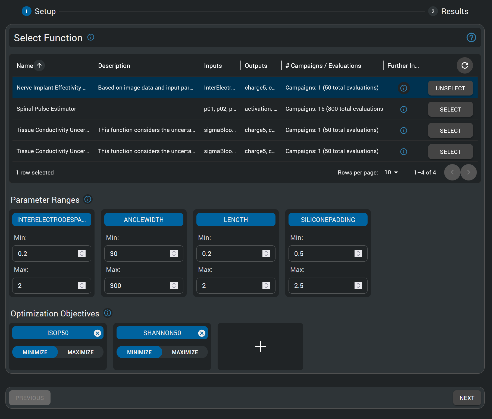

# Multi-Objective Genetic Algorithm (MOGA) Tutorial - Sural Nerve Pain Relief Neural Implant Design Optimization

!!! info "Model Intelligence: A Paradigm Shift in Simulation Analysis"

    Meta-modeling (or surrogate modeling) represents a transformative approach to understanding complex simulation models. By creating simplified mathematical representations of computationally intensive simulations, meta-modeling enables rapid exploration of parameter spaces that would otherwise require thousands of time-consuming simulations. This "model intelligence" approach empowers users to gain deeper insights into parameter sensitivities, optimize designs efficiently, quantify uncertainties, and make data-driven decisions with unprecedented speed. For bioelectronic applications, where biological variability and design parameters interact in complex ways, meta-modeling transforms raw simulation data into actionable knowledge - revealing relationships between inputs and outcomes that might remain hidden in traditional simulation approaches. The techniques you'll learn in this tutorial represent a major advancement in simulation analysis, allowing you to extract maximum value from your models while dramatically reducing computational overhead.

## Introduction

This tutorial demonstrates the power of Model Intelligence HyperTools for multi-objective optimization in bioelectronic device design. Unlike single-objective optimization, real-world engineering problems often involve competing objectives that must be balanced through intelligent tradeoffs.

In particular, a neural implant at the sural nerve will aim to disrupt pain signals for sural nerve pain patients, a chronic pain condition, while keeping within safe stimulation limits to prevent damage to the nerve and neighbouring tissues. The Multi-Objective Genetic Algorithm (MOGA) approach enables simultaneous optimization of multiple conflicting objectives, revealing the Pareto frontier of optimal design tradeoffs.

## Preparation

1. Sign into your sim4life.io / sim4life.science account. 
2. Click on the *+ New* button on the top left of the *Dashboard*.
3. Under the HyperTools section, choose *Multi-Objective Genetic Algorithm (MOGA)*

*MOGA HyperTools are available in the + New menu for multi-objective optimization studies.*

## Simulation Pipeline

!!! tip "Pipeline Foundation"
    This tutorial builds upon the sural nerve implant simulation pipeline detailed in the [Pipeline Setup Tutorial](pipeline-setup-tutorial.md). The pipeline's multiple competing objectives (safety vs. efficacy) make it ideally suited for multi-objective optimization through MOGA. For complete details on the computational workflow, objective definitions, and Function creation process, please refer to the Pipeline Setup Tutorial.

!!! note "Tutorial Data"
    For this tutorial, the pipeline has been configured as a Function with completed MOGA optimization campaigns, allowing you to directly explore multi-objective analysis results and Pareto frontier visualization without running computationally intensive genetic algorithm optimization.

## HyperTool Setup

### Starting a MOGA HyperTool

- In the Dashboard, press the "+ New" button on the top left
- In the **HyperTools** section, click on the "Multi-Objective Genetic Algorithm (MOGA)" option.
- Wait for the service to load.

### Choosing a Function and Configuring the MOGA Study

- In the "Function Setup" step, select the "Nerve Implant Effectivity & Safety" function. 
  - It should have the defined design parameters (Inter-Electrode Spacing, Angle Width, Length, Width, and Silicone Padding) as inputs, and the defined QoIs as outputs. 
  - The info button allows visualization of the underlying pipeline.
- For this tutorial, parameter ranges have already been determined.

*The MOGA HyperTool allows choice of the function to be analyzed, definition of parameter ranges, and selection of objectives for multi-objective optimization. For this tutorial, these ranges and objectives have already been configured.*

### Multi-Objective Optimization Configuration

The MOGA approach requires defining multiple competing objectives that will be simultaneously optimized. In bioelectronic device design, common objectives include:

- **Minimize stimulation threshold** (improve efficacy - lower current needed for activation)
- **Minimize safety metrics** (reduce risk - lower Shannon criteria, charge density)
- **Optimize geometric constraints** (practical manufacturing and implantation considerations)

- Once all parameter ranges and objectives have been configured, click "Next" to initiate the optimization process.
- Wait until the MOGA optimization completes. This operation might take several minutes as the genetic algorithm explores the design space.

## Analysis of Results

The MOGA HyperTool provides powerful visualizations for understanding multi-objective optimization results, most importantly the Pareto frontier - the set of optimal solutions where improvement in one objective can only be achieved by accepting degradation in another objective.

*Configuration of the multi-objective optimization setup, including selection of competing objectives, optimization direction (minimize/maximize), and genetic algorithm parameters such as population size, number of generations, and convergence criteria.*

### Understanding the Pareto Frontier

The core concept in multi-objective optimization is the Pareto frontier (also called Pareto front or Pareto optimal set). This represents the set of solutions where:
- No objective can be improved without degrading at least one other objective
- Each point represents a different optimal tradeoff between competing goals
- Engineers can select from these solutions based on specific priorities and constraints

### Visualizing Multi-Objective Results

The MOGA results are primarily visualized through the Pareto frontier plot, which shows the relationship between competing objectives and highlights the optimal design tradeoffs.

*The Pareto frontier visualization shows the optimal tradeoffs between competing objectives. Each point represents a different optimal design configuration. The frontier reveals that improvements in stimulation efficacy (lower isopercentile threshold) generally require accepting higher safety risks (higher Shannon criteria), demonstrating the fundamental tradeoff inherent in neural stimulation device design. Points along the frontier represent different engineering compromises - from highly conservative designs prioritizing safety to more aggressive designs prioritizing efficacy.*

*Pareto frontier with detailed solution ranking table showing Pareto optimal designs sorted by weighting criteria. The table displays the complete parameter configurations for each solution, including Inter-Electrode Spacing, Angle Width, Length, Width, and Silicone Padding values. The weighting system enables systematic comparison and selection of solutions based on different priority combinations between safety (Shannon criteria) and efficacy (isopercentile threshold) objectives. This quantitative ranking facilitates data-driven design selection for specific clinical requirements and regulatory constraints.*

### Interpreting the Results

The Pareto frontier provides several critical insights:

1. **Tradeoff Relationships**: The shape and slope of the frontier reveal how strongly objectives compete with each other
2. **Design Flexibility**: The spread of the frontier indicates how much flexibility exists in balancing objectives
3. **Optimal Operating Points**: Different regions of the frontier correspond to different design philosophies (safety-first vs. performance-first)
4. **Constraint Identification**: Areas where the frontier flattens may indicate physical or practical limits

### Extracting Design Recommendations

From the Pareto frontier analysis, engineers can:

1. **Identify knee points** - solutions offering the best compromise between objectives
2. **Select designs based on priorities** - choose points emphasizing safety, efficacy, or balanced performance
3. **Understand design limits** - recognize theoretical bounds on achievable performance
4. **Guide further optimization** - identify which parameters most strongly influence the tradeoffs

### Comparison with Response Surface Modeling Results

The MOGA optimization results can be directly compared with the optimal design identified through Response Surface Modeling analysis. The RSM tutorial identified a single optimal configuration:

**RSM Optimal Design:**
- Angle Width: 250º
- Inter-Electrode Spacing: 1.5mm  
- Length: 1mm
- Silicone Padding: 1.5mm
- Width: (fixed parameter in RSM analysis)

**MOGA Pareto Optimal Solutions:**
The weighted Pareto frontier table reveals multiple optimal configurations that offer different tradeoffs between safety and efficacy. The MOGA analysis includes electrode Width as an additional optimization parameter, providing a more comprehensive design space exploration. Notably, several MOGA solutions feature similar parameter ranges to the RSM optimum, but with systematic variations that explore the fundamental tradeoff space:

- **Safety-prioritized solutions** typically feature more conservative electrode dimensions
- **Efficacy-prioritized solutions** optimize for lower stimulation thresholds
- **Balanced solutions** often align closely with the RSM single-objective optimum

This comparison demonstrates how MOGA provides a comprehensive view of the design space that encompasses and extends beyond single-objective optimization results, revealing the complete landscape of optimal tradeoffs available to engineers.

<!-- ### Design Parameter Analysis

The MOGA results reveal how different parameter combinations contribute to Pareto optimal solutions:

- **Conservative designs** (emphasizing safety) typically feature:
  - Moderate electrode dimensions to limit current density
  - Optimized spacing to reduce field concentration
  - Enhanced insulation padding for biocompatibility

- **Performance-oriented designs** (emphasizing efficacy) typically feature:
  - Larger electrode coverage areas for better fiber recruitment
  - Optimized geometries for reduced activation thresholds
  - Configurations maximizing therapeutic current delivery

- **Balanced designs** (knee points) represent optimal engineering compromises that provide good performance in both objectives without extreme tradeoffs -->

<!-- ## Validation and Implementation

### Selecting an Optimal Design

Based on the Pareto frontier analysis, the selection of a final design depends on specific clinical requirements and regulatory constraints:

1. **Clinical Priority Assessment**: Determine whether patient safety or treatment efficacy takes precedence
2. **Regulatory Consideration**: Ensure selected design meets safety standards (Shannon criteria < 1.85)
3. **Manufacturing Constraints**: Consider practical limitations in electrode fabrication and implantation
4. **Patient Variability**: Account for biological variation in tissue properties and anatomy

### Design Validation

Once a candidate design is selected from the Pareto frontier, it should be validated through:

1. **Full simulation verification** using the exact parameters from the selected Pareto optimal point
2. **Sensitivity analysis** to ensure robustness against parameter uncertainties
3. **Clinical requirement verification** against established safety and efficacy benchmarks -->

## Conclusion

In this tutorial, we've explored how Multi-Objective Genetic Algorithm (MOGA) optimization can systematically address the inherent tradeoffs in bioelectronic device design. Through the Model Intelligence approach, we were able to:

1. **Simultaneously optimize competing objectives** of efficacy and safety without requiring subjective weighting functions
2. **Discover the Pareto frontier** revealing all optimal design tradeoffs available within the parameter space
3. **Understand fundamental design limitations** where improvements in one objective necessitate degradation in another
4. **Provide engineering decision support** with quantitative tradeoff analysis for design selection

The MOGA analysis revealed several key insights:
- Neural stimulation device design involves fundamental tradeoffs between efficacy and safety
- The Pareto frontier quantifies these tradeoffs, showing achievable performance bounds
- Different regions of the frontier correspond to different design philosophies and clinical priorities
- Optimal designs exist across a spectrum of compromises, not at a single point

This tutorial demonstrates how Model Intelligence tools can revolutionize complex engineering decisions by providing comprehensive optimization results that would be impossible to discover through traditional parameter studies. The MOGA approach is particularly valuable for bioelectronic applications where safety and efficacy must be carefully balanced, and where regulatory approval requires demonstrable optimization of competing objectives.

## Next Steps

For further exploration of the designs identified through MOGA optimization, we recommend:

1. **[Pipeline Setup Tutorial](pipeline-setup-tutorial.md)** - Understand the complete simulation workflow that enables multi-objective optimization and objective definition
2. **[Response Surface Modeling Tutorial](response-surface-modeling-tutorial.md)** - Analyze detailed parameter dependencies around Pareto optimal points
3. **[Uncertainty Quantification Tutorial](uncertainty-quantification-tutorial.md)** - Assess the robustness of selected designs against biological variability

The combination of pipeline understanding, MOGA optimization for design discovery, RSM for detailed analysis, and UQ for robustness assessment provides a comprehensive Model Intelligence workflow for advanced bioelectronic device development.