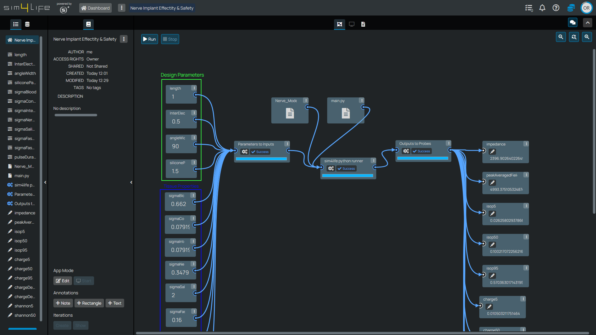

# Pipeline Setup Tutorial - Sural Nerve Pain Relief Neural Implant

!!! info "Model Intelligence: Function-Based Analysis Foundation"

    Model Intelligence HyperTools operate on **Functions** - immutable snapshots of your computational workflows that serve as the foundation for all meta-modeling analysis. Functions encapsulate the complete simulation pipeline, from input parameters through computational nodes to output quantities-of-interest (QoIs). This tutorial demonstrates how a complex bioelectronic simulation pipeline is structured and configured to enable Response Surface Modeling, Multi-Objective Genetic Algorithm optimization, and Uncertainty Quantification analysis.

## Introduction

This tutorial provides a detailed overview of the simulation pipeline that serves as the foundation for all Model Intelligence tutorials. Understanding the pipeline structure is essential for effectively using HyperTools, as the quality and scope of your analysis directly depends on how well your computational workflow is designed and parameterized.

The example pipeline focuses on a neural implant designed for sural nerve pain relief - a chronic pain condition that affects many patients. The pipeline demonstrates how complex bioelectronic simulations can be structured to support comprehensive design optimization and analysis through Model Intelligence tools.

## Pipeline Architecture

### Pipeline Workbench Overview

The Sim4Life Web pipeline workbench provides a visual interface for constructing computational workflows. For the sural nerve implant example, the workspace includes three main categories of components:

1. **Input parameters** for electrode design parameters, tissue conductivities, and simulation parameters
2. **Computational nodes** which build the model, perform simulations, and extract numerical results
3. **Output probes** for resulting output metrics (quantities-of-interest, QoIs)

*Complete sural nerve implant pipeline showing the flow from input parameters through computational nodes to output QoIs. This pipeline structure enables comprehensive analysis through RSM, MOGA, and UQ HyperTools.*

### Input Parameter Configuration

The pipeline exposes five key design parameters that will be systematically explored through Model Intelligence analysis:

**Geometric Design Parameters**
- **Inter-Electrode Spacing**: Distance between electrode contacts (mm)
- **Angle Width**: Angular coverage of electrode around nerve circumference (degrees)
- **Length**: Longitudinal extent of each electrode contact (mm)
- **Width**: Circumferential width of electrode contacts (mm)
- **Silicone Padding**: Additional insulation at electrode ends (mm)

**Tissue Property Parameters**
- **Blood Conductivity**: Electrical conductivity of blood vessels (S/m)
- **Epineurium Conductivity**: Outer nerve sheath conductivity (S/m)
- **Perineurium Conductivity**: Fascicle bundle sheath conductivity (S/m)
- **Fascicle Conductivity (Longitudinal)**: Axial nerve fiber conductivity (S/m)
- **Fascicle Conductivity (Transversal)**: Radial nerve fiber conductivity (S/m)

These parameters represent the key design variables and biological uncertainties that engineers must consider when optimizing neural stimulation devices.

### Computational Workflow

The simulation pipeline implements a comprehensive multi-physics approach to neural stimulation analysis:

#### 1. Anatomical Model Preparation
**Histological Nerve Cross-Section Loading**
- Import segmented multifascicular nerve geometry from histological data
- Preserve realistic fascicle arrangement and perineurium boundaries
- Maintain anatomical accuracy for realistic stimulation predictions

**Mesh Generation and Extrusion**
- Generate high-quality 2D finite element mesh of nerve cross-section
- Perform 2.5D extrusion to create volumetric simulation domain
- Optimize mesh density for computational efficiency and accuracy

#### 2. Electrode Integration
**Parameterized Electrode Insertion**
- Position electrodes according to geometric design parameters
- Apply parameterized dimensions (angle width, length, inter-electrode spacing)
- Add silicone insulation padding with specified thickness
- Ensure realistic electrode-tissue interface representation

#### 3. Electromagnetic Simulation
**Field Distribution Calculation**
- Set up electromagnetic (EM) simulation with parameterized tissue conductivities
- Apply stimulation boundary conditions based on clinical protocols
- Solve for electric field and current density distributions
- Account for frequency-dependent tissue properties

#### 4. Safety Metrics Extraction
**Tissue Damage Risk Assessment**
- **Impedance Calculation**: Electrode-tissue interface impedance
- **E_IEEE Peak Exposure**: Maximum electric field exposure per IEEE standards
- **Charge-per-Phase**: Total charge delivered per stimulation pulse
- **Charge-Density-per-Phase**: Charge density at electrode-tissue interface
- **Shannon Criteria**: Comprehensive safety metric for neurostimulation

#### 5. Neurophysiological Modeling
**Fiber Response Simulation**
- Add realistic fiber trajectories with statistically varying diameters
- Implement biophysically accurate axon models (e.g., McIntyre-Richardson-Grill)
- Calculate activation thresholds for individual nerve fibers
- Extract population-level recruitment statistics

#### 6. Efficacy Metrics Extraction
**Stimulation Effectiveness Quantification**
- **Recruitment Isopercentiles**: Current thresholds for 10%, 50%, and 90% fiber activation
- **Selectivity Metrics**: Ability to activate specific nerve populations
- **Therapeutic Window**: Range between effective and harmful stimulation levels

## Output Quantities of Interest (QoIs)

### Safety-Related Outputs

The pipeline generates multiple safety metrics that must be maintained within acceptable limits:

**Shannon Criteria (shannon50)**
- Comprehensive safety metric combining charge, charge density, and frequency
- Threshold typically set at +1.85 for safe neurostimulation
- Lower values indicate safer stimulation parameters
- Critical for regulatory approval and clinical translation

**Charge Density Metrics**
- Charge-per-phase and charge-density-per-phase calculations
- Essential for preventing electrode corrosion and tissue damage
- Must comply with established safety standards (e.g., 30 μC/cm²)

**Electric Field Exposure**
- E_IEEE peak exposure measurements
- Compliance with international safety guidelines
- Protection against thermal tissue damage

### Efficacy-Related Outputs

The pipeline quantifies stimulation effectiveness through multiple metrics:

**Isopercentile Thresholds (isop10, isop50, isop90)**
- Current levels required to activate 10%, 50%, and 90% of nerve fibers
- Lower thresholds indicate more efficient stimulation
- isop50 commonly used as primary efficacy metric
- Provides insight into population heterogeneity and selectivity

**Recruitment Curves**
- Complete stimulus-response relationships
- Enable optimization of stimulation protocols
- Support patient-specific therapy customization

**Impedance Characteristics**
- Electrode-tissue interface properties
- Influence battery life and stimulation efficiency
- Critical for device longevity and performance

## Pipeline Validation and Quality Assurance

### Simulation Accuracy Verification

**Mesh Independence Testing**
- Verify results are independent of mesh resolution
- Balance computational efficiency with numerical accuracy
- Ensure stable convergence across parameter ranges

**Physical Validation**
- Compare simulation results with experimental data where available
- Validate tissue property assignments against literature values
- Verify electrode model accuracy through impedance measurements

**Boundary Condition Assessment**
- Ensure appropriate simulation domain size
- Validate boundary condition implementation
- Check for numerical artifacts or unphysical results

### Parameter Sensitivity Assessment

**Preprocessing Analysis**
- Identify parameters with strongest influence on outputs
- Verify parameter ranges encompass realistic design space
- Ensure adequate sensitivity for meaningful optimization

**Cross-Validation Preparation**
- Structure pipeline for robust surrogate model generation
- Implement consistent random seeding for reproducibility
- Prepare data export formats compatible with HyperTools

## Function Creation and Registration

### Function Definition Process

Once the pipeline is validated and tested, it must be registered as a Function for use with Model Intelligence HyperTools:

**Parameter Exposure**
- Define which pipeline parameters will be exposed for analysis
- Set appropriate parameter ranges based on manufacturing and safety constraints
- Configure parameter units and descriptions for clarity

**Output Selection**
- Choose which QoIs will be available for analysis
- Ensure outputs are relevant for intended optimization objectives
- Verify output units and scaling for numerical stability

**Function Registration**
- Create immutable Function snapshot of the validated pipeline
- Generate Function description and metadata
- Test Function execution across parameter ranges

### Quality Assurance for HyperTools

**Surrogate Model Readiness**
- Verify smooth parameter-output relationships
- Check for discontinuities or numerical instabilities
- Ensure adequate dynamic range in outputs

**Computational Optimization**
- Optimize pipeline execution time for sampling campaigns
- Implement checkpointing and error recovery
- Prepare for parallel execution when needed

## Applications Across HyperTools

### Response Surface Modeling Applications

The pipeline structure directly enables comprehensive RSM analysis:
- **Parameter Sensitivity**: Understanding which design variables most influence safety and efficacy
- **Interaction Effects**: Discovering how parameters interact to influence outcomes
- **Design Space Visualization**: Creating intuitive visualizations of parameter-performance relationships

### Multi-Objective Genetic Algorithm Applications

The pipeline's multiple competing objectives make it ideal for MOGA optimization:
- **Safety vs. Efficacy Tradeoffs**: Systematic exploration of fundamental engineering compromises
- **Pareto Frontier Discovery**: Identification of optimal design tradeoff curves
- **Multi-Constraint Optimization**: Simultaneous satisfaction of safety standards and performance requirements

### Uncertainty Quantification Applications

The pipeline's tissue property parameters enable robust UQ analysis:
- **Biological Variability**: Quantifying performance variations due to patient-to-patient differences
- **Manufacturing Tolerances**: Assessing robustness to electrode fabrication variations
- **Regulatory Confidence**: Providing statistical evidence for safety margins and reliability

## Conclusion

This pipeline tutorial demonstrates how complex bioelectronic simulations can be systematically structured to enable comprehensive Model Intelligence analysis. The sural nerve implant example showcases the integration of:

- **Multi-physics modeling** combining electromagnetic simulation with neurophysiological response
- **Safety and efficacy metrics** addressing regulatory and clinical requirements
- **Parameterized design space** enabling systematic optimization and analysis
- **Quality assurance protocols** ensuring reliable and accurate analysis results

The pipeline architecture presented here serves as the foundation for all subsequent Model Intelligence tutorials, providing the computational substrate that enables rapid exploration of design alternatives through RSM visualization, systematic multi-objective optimization through MOGA, and robust uncertainty analysis through UQ.

Understanding this pipeline structure is essential for effectively applying Model Intelligence tools to your own bioelectronic design challenges, as the quality and scope of your analysis directly depends on how well your computational workflow captures the essential physics, constraints, and objectives of your specific application.

## Next Steps

With the pipeline foundation established, you can now proceed to explore the specific Model Intelligence analysis capabilities:

- **[Response Surface Modeling Tutorial](response-surface-modeling-tutorial.md)**: Learn to visualize and understand parameter dependencies
- **[Multi-Objective Genetic Algorithm (MOGA) Tutorial](moga-tutorial.md)**: Discover optimal tradeoffs between competing design objectives  
- **[Uncertainty Quantification Tutorial](uncertainty-quantification-tutorial.md)**: Assess design robustness under parameter uncertainty

Each tutorial builds upon this pipeline foundation to demonstrate different analysis perspectives on the same underlying bioelectronic design challenge.