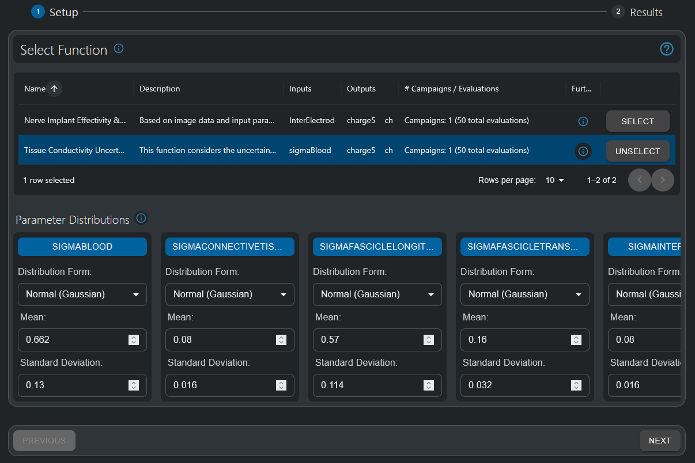
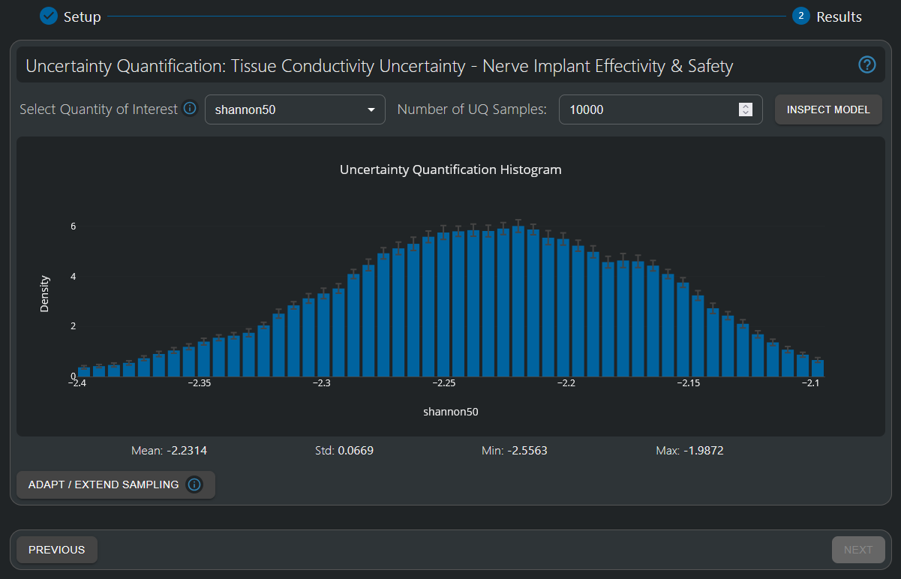
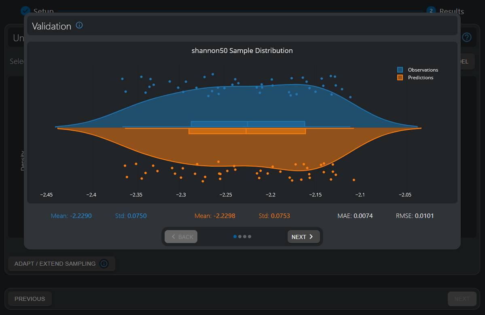
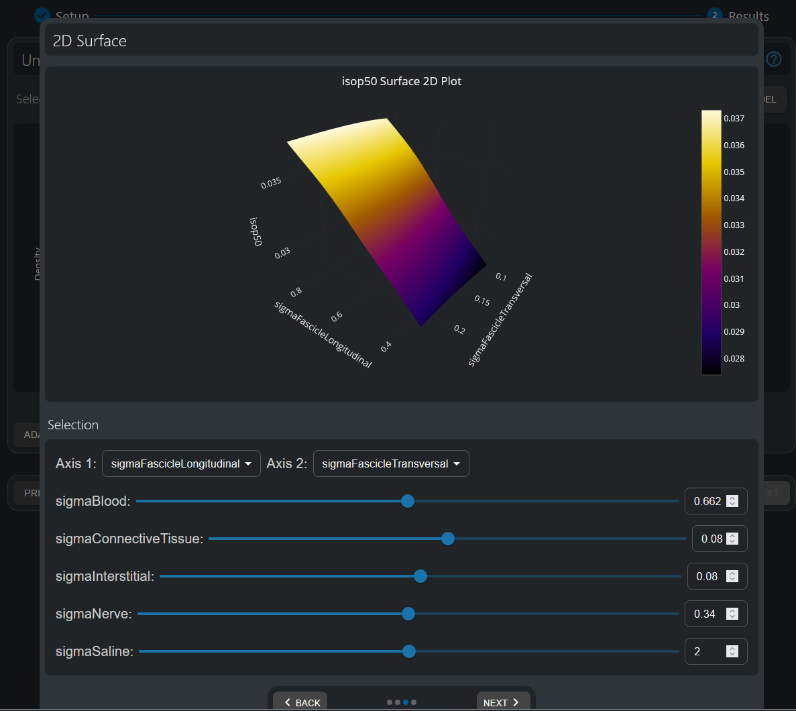

# Uncertainty Quantification Tutorial - Sural Nerve Pain Relief Neural Implant Tissue Conductivity Uncertainty Quantification

!!! info "Model Intelligence: A Paradigm Shift in Simulation Analysis"

    Meta-modeling (or surrogate modeling) represents a transformative approach to understanding complex simulation models. By creating simplified mathematical representations of computationally intensive simulations, meta-modeling enables rapid exploration of parameter spaces that would otherwise require thousands of time-consuming simulations. This "model intelligence" approach empowers users to gain deeper insights into parameter sensitivities, optimize designs efficiently, quantify uncertainties, and make data-driven decisions with unprecedented speed. For bioelectronic applications, where biological variability and design parameters interact in complex ways, meta-modeling transforms raw simulation data into actionable knowledge - revealing relationships between inputs and outcomes that might remain hidden in traditional simulation approaches. The techniques you'll learn in this tutorial represent a major advancement in simulation analysis, allowing you to extract maximum value from your models while dramatically reducing computational overhead.

## Introduction

This tutorial demonstrates the potential of Model Intelligence HyperTools to establish statistically rigorous confidence intervals for the optimal design parameters when accounting for the inherent variability in model parameters, such as in human tissue properties. 

The Uncertainty Quantification HyperTool provides a robust framework for quantifying output variability - a critical requirement for regulatory submission and clinical translation of bioelectronic devices. This capability allows engineers and researchers to efficiently demonstrate the statistical reliability of their designs across physiologically relevant parameter ranges.

## Preparation

1. Sign into your sim4life.io / sim4life.science account. 
2. Click on the *+ New* button on the top left of the *Dashboard*.
3. Under the HyperTools section, choose *Uncertainty Quantification*

*HyperTools are available in the + New menu.*

## Simulation Pipeline

!!! tip "Pipeline Foundation"
    This tutorial builds upon the sural nerve implant simulation pipeline detailed in the [Pipeline Setup Tutorial](pipeline-setup-tutorial.md). The pipeline's tissue property parameters are particularly well-suited for uncertainty quantification analysis, as they represent biological variability that is inherent in patient populations. For complete details on the computational workflow and Function creation process, please refer to the Pipeline Setup Tutorial.

!!! note "Tutorial Data"
    For this tutorial, the pipeline has been configured as a Function with pre-executed uncertainty quantification sampling campaigns, allowing you to directly explore statistical analysis capabilities without running computationally intensive Monte Carlo simulations.

## HyperTool Setup

### Starting an Uncertainty Quantification HyperTool

- In the Dashboard, press the "+ New" button on the top left
- In the **HyperTools** section, click on the *Uncertainty Quantification* option.
- Wait for the service to load.

### Choosing a Function

- In the *Function Setup* step, select the *Tissue Conductivity Uncertainty - Nerve Implant Effectivity & Safety* function. 
  - It should have the defined conductivities (typically denoted as *sigma*) for different tissues as inputs, and the defined QoIs as outputs. 
  - The info button allows visualization of the underlying pipeline.
- For this tutorial, parameter ranges have already been determined. The mean has been set to values available in the literature (see [IT'IS Low Frequency Tissue Database](https://itis.swiss/virtual-population/tissue-properties/database/low-frequency-conductivity/)) and standard deviation has been set to 20% of the mean value.

*The HyperTool allows choice of the function to be analyzed, and definition of the parameter distribution (constant, uniform, normal - e.g. Gaussian, etc). For this tutorial, normal (Gaussian) distributions were chosen (as they are the most typical characterization of naturally occurring uncertainties). The mean values were set according to the literature-based IT'IS Low Frequency Tissue Database, and the standard deviations were set to 20% of the corresponding mean value.*

- Once all parameter ranges have been chosen (pre-selected in this tutorial), click "Next" to move to results analysis.
- Wait until the AI model is generated. This operation might take a few minutes.

## Analysis of Results

The Uncertainty Quantification HyperTool allows users to quantify output variability, establishing statistically rigorous confidence intervals on efficiency and safety metrics. 
This is a critical requirement for regulatory submission and clinical translation of bioelectronic devices. This capability allows engineers and researchers to efficiently demonstrate the statistical reliability of their designs across physiologically relevant parameter ranges. 

Traditional sensitivity analysis focuses on sweeps over single uncertain variables to determine their effect on the quantity of interest - investigating the interplay between multiple uncertain parameters quickly becomes computationally prohibitive as the number of input parameters increases - the required number of samples is # samples per parameter ^ (# parameters). Using a very minimal 3 samples per parameter for the six parameters in this tutorial, that would already imply over 700 samples.

The Uncertainty Quantification HyperTool uses an alternative approach:

1. A low density sampling of the parameter space is generated (50 samples in this tutorial - equivalent to 1.92 samples per dimension)
2. A surrogate model is fitted to the simulated data (observations).
3. This surrogate model can be used to very efficiently evaluate a high-density sampling of the input parameter space (*Number of UQ Samples*, 10,000 by default) according to the statistical distributions specified by the user. 
4. A histogram of all propagated samples is assembled, producing a rigorous statistical description of the output quantity, accounting for complex interplays between (possibly non-linear) parameters.

This methodology provides a more solid uncertainty estimation than the combination of multiple traditional single-parameter sensitivity analyses.

*The Uncertainty Quantification Histogram provides a rigorous statistical description of the output quantity of interest, accounting for non-linear parameter dependencies and parameter interplay. Here, the distribution of the values of the Shannon Criteria at 50% current threshold isopercentile (i.e. the current [mA] value at which 50% of the fibers in the nerve have been activated) provides a statistical description of the safety of the implantable device. The mean (-2.23) is, as could be expected, close the value predicted for the optimal design parameters (-2.24) in the previous tutorial. Its shape is approximately Gaussian. Importantly, its standard deviation (0.066) is ~3% of the mean value (-2.23), even though all input parameter distributions were given a standard deviation 20% of their mean value. This implies that the safety of the stimulation is stable and not highly influenced by tissue conductivities, which increases its reliability and potential for regulatory approval.*

Additionally, the Uncertainty Propagation Histogram provides error bars associated with the uncertainty propagation process itself - multiple (50) runs of stochastic sampling of the underlying Gaussian Process are used to assess whether the propagated uncertainty distribution has converged. Large error bars indicate that not sufficient UQ samples are being used.

## Validate Model Quality

The Uncertainty Quantification Histogram relies on a surrogate model fitted to the sampled data (observations), and the accuracy of the predicted histogram relies on a good quality-of-fit of this surrogate model.

The *Inspect Model* button on the top-right corner enables users to validate the model's quality-of-fit through cross-validation. Additionally, one / two / three dimensional visualizations of parameter influence on outputs can be utilized to gain further insights on which are the most relevant parameters, and therefore their uncertainty will be more impactful on the final result. For a full description of these visualizations, please refer to the [previous tutorial](response-surface-modeling-tutorial.md) or to the [Manual](../manual/response-surface-modeling.md).

*The distribution of simulated data (observations) and surrogate predictions are highly aligned, with a per-sample mean absolute error (MAE) of 7.4e-3 - approximately ~10% of the standard deviation in the data, 7.5e-2. This indicates a very good quality-of-fit, and therefore the surrogate can be reliably utilized to propagate uncertainty.*

*Two dimensional surface visualizations enable to inspect the influence of different parameters on the output of interest. In this plot, it can be observed how the conductivity of the fascicle in the longitudinal direction has a nearly linear effect on the 50% threshold isopercentile current (although the total induced variation is not too large), meanwhile the conductivity of the fascicle in the transversal direction has nearly no effect.*

## Conclusion

In this tutorial, we've demonstrated how the Uncertainty Quantification HyperTool provides a powerful framework for assessing the statistical reliability of bioelectronic designs across physiologically relevant parameter ranges. By efficiently propagating input uncertainties through a surrogate model, we've established rigorous confidence intervals for safety and efficacy metrics - a critical requirement for regulatory submission and clinical translation.

Key takeaways from this tutorial:

1. With just 50 simulation samples, we've characterized the full statistical distribution of output metrics that would traditionally require thousands of simulations.
2. Despite 20% variability in tissue conductivity parameters, the Shannon safety criteria showed only ~3% variability, demonstrating the robustness of the design.
3. Cross-validation confirmed excellent surrogate model accuracy, providing confidence in the uncertainty quantification results.
4. This approach enables statistically sound decision-making that accounts for the complex interplay between biological variability and design parameters.

The Uncertainty Quantification HyperTool represents a paradigm shift from deterministic to probabilistic design validation, allowing engineers to efficiently quantify and communicate the statistical reliability of their designs - a capability increasingly demanded by regulatory bodies and essential for successful clinical translation of bioelectronic therapies.

## Related Resources

- [Pipeline Setup Tutorial](pipeline-setup-tutorial.md): Understand the complete simulation workflow that enables uncertainty quantification analysis
- [Response Surface Modeling Tutorial](response-surface-modeling-tutorial.md): Learn the fundamentals of surrogate modeling
- [Multi-Objective Genetic Algorithm (MOGA) Tutorial](moga-tutorial.md): Discover how to systematically optimize competing objectives and explore Pareto optimal designs
- [Uncertainty Quantification Manual](../manual/uncertainty-quantification.md): Comprehensive reference documentation
- [Setup Guide](../manual/setup.md): Detailed configuration instructions

For a comprehensive Model Intelligence workflow, combine pipeline understanding with UQ for robustness assessment, RSM for detailed parameter analysis, and MOGA for multi-objective optimization to achieve advanced bioelectronic device development capabilities.